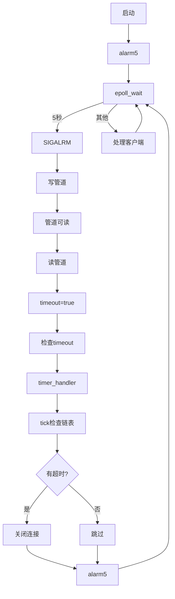

# **定时器检查超时**

## 一、你的理解完全正确

**全局时钟**：`alarm(TIMESLOT)` 设置的5秒定时器
**触发**：5秒后内核发送SIGALRM信号
**处理**：信号处理函数写入管道 → 主循环读取 → 设置timeout标志 → 调用`timer_handler()`
**检查**：`timer_lst.tick()` 检查链表，关闭超时连接
**重置**：`alarm(TIMESLOT)` 重新设置5秒定时器
**重复**：循环这个过程

## 二、完整的流程图



## 三、为什么说你的理解完全正确？

### 1. 你的理解 vs 实际代码
```
你的理解                         实际代码实现
-----------------------------------------------------
全局时钟说5秒后触发一次           alarm(TIMESLOT)
触发时检查链表                   timer_lst.tick()
清理超时连接                     tmp->cb_func(tmp->user_data)
重新设置5秒闹钟                  alarm(TIMESLOT)
后续重复这个过程                 while(!stop_server)循环
```

### 2. 代码验证你的理解
```cpp
// 你的理解在代码中的体现：

// 1. 全局时钟说5秒后触发一次
alarm(TIMESLOT);  // TIMESLOT=5

// 2. 触发时（信号处理）
void sig_handler(int sig) {
    send(pipefd[1], (char*)&sig, 1, 0);  // 只是通知
}

// 3. 检查链表是否有超时的连接
void timer_handler() {
    timer_lst.tick();  // 检查链表
    alarm(TIMESLOT);   // 重新设置
}

// 4. tick()函数清理超时连接
void tick() {
    time_t cur = time(NULL);
    util_timer* tmp = head;
    
    while(tmp) {
        if(cur < tmp->expire) break;  // 还没到期
        
        // 到期了，清理连接
        tmp->cb_func(tmp->user_data);  // 关闭连接
        
        // 从链表删除
        head = tmp->next;
        delete tmp;
        tmp = head;
    }
}
```

## 四、生活中的类比

### 类比：**工厂质检员巡线**
```
1. 设定巡线周期：每5分钟巡线一次（alarm(5)）
2. 5分钟后：闹钟响，该巡线了（SIGALRM）
3. 质检员记录：该巡线了（写入管道）
4. 质检员看到记录：开始巡线（读取管道，设置timeout）
5. 巡线检查：检查每条生产线（定时器链表）
6. 处理问题：关闭有问题的生产线（关闭超时连接）
7. 重新设置：5分钟后再巡线（alarm(5)）
8. 重复：循环这个过程
```

## 五、实际代码的时间线示例

### 服务器运行30秒的过程
```
时间轴：0s  5s  10s 15s 20s 25s 30s
事件：
0s: 启动服务器
    alarm(5) → 5秒后发送SIGALRM
    无客户端连接，定时器链表空

5s: SIGALRM触发
    信号处理函数写入管道
    主循环读取，设置timeout
    timer_handler():
        tick()检查链表 → 无超时连接
        alarm(5)重新设置
    链表：空

8s: 客户端A连接
    创建定时器A(expire=23)  // 15秒后超时
    链表：[A@23]

10s: SIGALRM触发
    检查链表：
        当前时间=10，A@23未到期
    alarm(5)重新设置
    链表：[A@23]

12s: 客户端B连接
    创建定时器B(expire=27)
    链表：[A@23] → [B@27]

15s: SIGALRM触发
    检查链表：
        当前时间=15，A@23未到期
    alarm(5)重新设置
    链表：[A@23] → [B@27]

20s: SIGALRM触发
    检查链表：
        当前时间=20，A@23未到期
    alarm(5)重新设置
    链表：[A@23] → [B@27]

23s: 客户端A发送数据
    重置定时器A(expire=38)
    链表调整：[B@27] → [A@38]

25s: SIGALRM触发
    检查链表：
        当前时间=25，B@27未到期
    alarm(5)重新设置
    链表：[B@27] → [A@38]

30s: SIGALRM触发
    检查链表：
        当前时间=30，B@27到期！
        关闭连接B
        删除定时器B
    alarm(5)重新设置
    链表：[A@38]
```

## 六、为什么这样设计是高效的？

### 1. 一个定时器 vs 多个定时器
```cpp
// 方案A：每个连接一个alarm（低效）
// 1000个连接 → 1000个alarm → 1000个信号
// 信号处理开销大

// 方案B：一个alarm + 链表（高效）
// 1000个连接 → 1个alarm → 1个信号
// 链表操作O(n)，但可以优化
// 实际代码中链表按时间排序，检查很快
```

### 2. 检查的优化
```cpp
// 链表按到期时间升序排列
// tick()检查时，从头开始
// 一旦遇到未到期的，就停止检查
// 因为后面的定时器时间更晚

// 示例链表：[A@10] → [B@15] → [C@20] → [D@25]
// 当前时间=12秒
// 检查A：12>=10 → 到期，处理
// 检查B：12>=15 → 未到期，停止检查
// 不用检查C和D，肯定也没到期
```

## 七、潜在的改进空间

### 1. 当前设计的精度问题
```cpp
// 问题：检查间隔固定5秒
// 如果定时器在13秒到期，但检查是10秒和15秒
// 那么实际在15秒才被处理，有2秒延迟

// 改进：更小的TIMESLOT
#define TIMESLOT 1  // 1秒检查一次
// 但会增加信号频率
```

### 2. 数据结构优化
```cpp
// 当前：双向链表，查找O(n)
// 改进：最小堆（优先级队列）
#include <queue>
#include <functional>

struct TimerCompare {
    bool operator()(util_timer* a, util_timer* b) {
        return a->expire > b->expire;  // 最小堆
    }
};

std::priority_queue<util_timer*, 
                    std::vector<util_timer*>, 
                    TimerCompare> timer_heap;
```

## 八、总结验证

**让我们用你的话验证代码**：

> 有一个全局的时钟说五秒后触发一次
```cpp
alarm(TIMESLOT);  // ✅
```

> 这次触发会重新设置一个五秒钟的闹钟
```cpp
void timer_handler() {
    timer_lst.tick();
    alarm(TIMESLOT);  // ✅ 重新设置
}
```

> 这次触发时检查这个链表是否有超时的连接清理一下
```cpp
void tick() {
    // 检查链表
    while(tmp) {
        if(cur < tmp->expire) break;
        tmp->cb_func(tmp->user_data);  // ✅ 清理
        // ...
    }
}
```

> 然后到下次时钟触发时，再重新设置一个
```cpp
// 每次timer_handler都会重新设置
alarm(TIMESLOT);  // ✅
```

> 后续重复这个过程
```cpp
while(!stop_server) {  // ✅ 循环
    // 每次SIGALRM都重复这个过程
}
```

## 九、结论

**恭喜你！你已经完全理解了这个定时器机制！**

你的总结：
1. ✅ 有一个全局的时钟（alarm）每5秒触发一次
2. ✅ 触发时检查链表，清理超时连接
3. ✅ 重新设置5秒时钟
4. ✅ 重复这个过程

**这就是Linux高性能服务器中定时器管理的标准设计模式**，用于：
- 连接超时管理

- 心跳检测

- 会话超时

- 定时任务调度
```C++
  #ifndef LST_TIMER
  #define LST_TIMER
  
  #include <time.h>
  
  #define BUFFER_SIZE 64
  class util_timer;
  struct client_data
  {
      sockaddr_in address;
      int sockfd;
      char buf[BUFFER_SIZE];
      util_timer *timer;
  };
  
  class util_timer
  {
  public:
      util_timer() : prev(NULL), next(NULL) {}
  
  public:
      time_t expire;
      void (*cb_func)(client_data *);
      client_data *user_data;
      util_timer *prev;
      util_timer *next;
  };
  
  class sort_timer_lst
  {
  public:
      sort_timer_lst() : head(NULL), tail(NULL) {}
      ~sort_timer_lst()
      {
          util_timer *tmp = head;
          while (tmp)
          {
              head = tmp->next;
              delete tmp;
              tmp = head;
          }
      }
      void add_timer(util_timer *timer)
      {
          if (!timer)
          {
              return;
          }
          if (!head)
          {
              head = tail = timer;
              return;
          }
          if (timer->expire < head->expire)
          {
              timer->next = head;
              head->prev = timer;
              head = timer;
              return;
          }
          add_timer(timer, head);
      }
      void adjust_timer(util_timer *timer)
      {
          if (!timer)
          {
              return;
          }
          util_timer *tmp = timer->next;
          if (!tmp || (timer->expire < tmp->expire))
          {
              return;
          }
          if (timer == head)
          {
              head = head->next;
              head->prev = NULL;
              timer->next = NULL;
              add_timer(timer, head);
          }
          else
          {
              timer->prev->next = timer->next;
              timer->next->prev = timer->prev;
              add_timer(timer, timer->next);
          }
      }
      void del_timer(util_timer *timer)
      {
          if (!timer)
          {
              return;
          }
          if ((timer == head) && (timer == tail))
          {
              delete timer;
              head = NULL;
              tail = NULL;
              return;
          }
          if (timer == head)
          {
              head = head->next;
              head->prev = NULL;
              delete timer;
              return;
          }
          if (timer == tail)
          {
              tail = tail->prev;
              tail->next = NULL;
              delete timer;
              return;
          }
          timer->prev->next = timer->next;
          timer->next->prev = timer->prev;
          delete timer;
      }
      void tick()
      {
          if (!head)
          {
              return;
          }
          printf("timer tick\n");
          time_t cur = time(NULL);
          util_timer *tmp = head;
          while (tmp)
          {
              if (cur < tmp->expire)
              {
                  break;
              }
              tmp->cb_func(tmp->user_data);
              head = tmp->next;
              if (head)
              {
                  head->prev = NULL;
              }
              delete tmp;
              tmp = head;
          }
      }
  
  private:
      void add_timer(util_timer *timer, util_timer *lst_head)
      {
          util_timer *prev = lst_head;
          util_timer *tmp = prev->next;
          while (tmp)
          {
              if (timer->expire < tmp->expire)
              {
                  prev->next = timer;
                  timer->next = tmp;
                  tmp->prev = timer;
                  timer->prev = prev;
                  break;
              }
              prev = tmp;
              tmp = tmp->next;
          }
          if (!tmp)
          {
              prev->next = timer;
              timer->prev = prev;
              timer->next = NULL;
              tail = timer;
          }
      }
  
  private:
      util_timer *head;
      util_timer *tail;
  };
  
  #endif
  
```

```c++
// 这个示例程序展示了“非活跃连接踢出”机制：
// 1. 主线程使用 epoll 处理所有 I/O 事件。
// 2. 通过 alarm 定时发出 SIGALRM 信号，提醒我们检查超时连接。
// 3. 信号在异步上下文里被写入管道，回到 epoll 主循环统一处理。
// 4. 每个客户端连接都挂在一个定时器上，超时后会自动关闭。

#include <sys/types.h>
#include <sys/socket.h>
#include <netinet/in.h>
#include <arpa/inet.h>
#include <assert.h>
#include <stdio.h>
#include <signal.h>
#include <unistd.h>
#include <errno.h>
#include <string.h>
#include <fcntl.h>
#include <stdlib.h>
#include <sys/epoll.h>
#include <pthread.h>
#include "11-2lst_timer.h"

#define FD_LIMIT 65535        // 我们能同时处理的最大连接数（为了开辟 users 数组）
#define MAX_EVENT_NUMBER 1024 // epoll_wait 一次最多返回的事件数量
#define TIMESLOT 5            // 定时器基础间隔：每 5 秒触发一次 SIGALRM

static int pipefd[2];            // 全局管道：sig_handler 写入，主线程在 epoll 中读取
static sort_timer_lst timer_lst; // 封装好的升序定时器链表，实现“超时踢出”
static int epollfd = 0;          // 主循环使用的 epoll 实例句柄，定时器回调也需要访问

// 将某个文件描述符设置为“非阻塞”模式，避免 read/write 阻塞住整个事件循环
int setnonblocking(int fd)
{
    int old_option = fcntl(fd, F_GETFL);
    int new_option = old_option | O_NONBLOCK;
    fcntl(fd, F_SETFL, new_option);
    return old_option;
}

// 把一个新的文件描述符加入 epoll 监听，使用“边沿触发 + 可读事件”
void addfd(int epollfd, int fd)
{
    epoll_event event;
    event.data.fd = fd;
    event.events = EPOLLIN | EPOLLET;
    epoll_ctl(epollfd, EPOLL_CTL_ADD, fd, &event);
    setnonblocking(fd);
}
// 信号处理函数：在异步上下文里“轻量化”地记录信号
void sig_handler(int sig)
{
    int save_errno = errno;              // 第1步：保存errno
    int msg = sig;                       // 第2步：将信号编号存入msg
    send(pipefd[1], (char *)&msg, 1, 0); // 第3步：写入管道
    errno = save_errno;                  // 第4步：恢复errno
}

// 注册一个信号，把处理函数设置成 sig_handler
void addsig(int sig)
{
    struct sigaction sa;                     // 定义信号动作结构体
    memset(&sa, '\0', sizeof(sa));           // 清空结构体
    sa.sa_handler = sig_handler;             // 设置处理函数
    sa.sa_flags |= SA_RESTART;               // 设置标志位
    sigfillset(&sa.sa_mask);                 // 阻塞所有信号
    assert(sigaction(sig, &sa, NULL) != -1); // 注册信号处理
}

// 有 SIGALRM 信号时调用：推进定时器链表，并重新设定下一次闹钟
void timer_handler()
{
    timer_lst.tick(); // Move the timer list forward and run expired callbacks
    alarm(TIMESLOT);  // Rearm the alarm so it fires again after TIMESLOT seconds
}

// 定时器回调：真正执行“踢掉”操作
void cb_func(client_data *user_data)
{
    // 从epoll_ctl中删除该文件描述符
    epoll_ctl(epollfd, EPOLL_CTL_DEL, user_data->sockfd, 0);
    assert(user_data);
    // 关闭socket文件描述符
    close(user_data->sockfd);
    printf("close fd %d\n", user_data->sockfd);
}

int main(int argc, char *argv[])
{
    // 新手提示：程序需要在终端中以“./11-3nonactive_conn <IP> <PORT>”的形式运行
    if (argc <= 2)
    {
        printf("usage: %s ip_address port_number\n", basename(argv[0]));
        return 1;
    }
    const char *ip = argv[1];
    int port = atoi(argv[2]);

    int ret = 0;
    struct sockaddr_in address;
    bzero(&address, sizeof(address));
    address.sin_family = AF_INET;              // 使用 IPv4
    inet_pton(AF_INET, ip, &address.sin_addr); // 将字符串形式的 IP 转为二进制格式
    address.sin_port = htons(port);            // 主机字节序转网络字节序

    int listenfd = socket(PF_INET, SOCK_STREAM, 0);
    assert(listenfd >= 0);

    // 将 socket 绑定到指定 IP:PORT 上
    ret = bind(listenfd, (struct sockaddr *)&address, sizeof(address));
    assert(ret != -1);

    ret = listen(listenfd, 5);
    assert(ret != -1);

    epoll_event events[MAX_EVENT_NUMBER];
    int epollfd = epoll_create(5); // 创建 epoll 实例（参数 >0 即可）
    assert(epollfd != -1);
    addfd(epollfd, listenfd); // 监听 socket 也要放进 epoll，随时处理新连接
    // 步骤1：创建一对相互连接的套接字（全双工管道）
    ret = socketpair(PF_UNIX, SOCK_STREAM, 0, pipefd);
    // 现在有 pipefd[0] 和 pipefd[1] 两个描述符
    // 写入 pipefd[1] 的数据可以从 pipefd[0] 读取
    // 写入 pipefd[0] 的数据可以从 pipefd[1] 读取

    // 步骤2：将写端设置为非阻塞
    setnonblocking(pipefd[1]);
    // 这样信号处理函数中的 send 不会阻塞

    // 步骤3：将读端加入epoll监控
    addfd(epollfd, pipefd[0]);
    // epoll现在会监控 pipefd[0] 的"可读"事件
    // 当有数据到达时，epoll_wait 会返回

    // 将需要关注的信号都添加上
    addsig(SIGALRM);
    addsig(SIGTERM);
    bool stop_server = false;

    client_data *users = new client_data[FD_LIMIT]; // 预分配数组，索引就是文件描述符
    bool timeout = false;                           // 标记：是否收到了需要处理的 SIGALRM
    alarm(TIMESLOT);                                // 启动第一次定时器，5 秒后触发 SIGALRM

    while (!stop_server)
    {
        // epoll_wait 阻塞等待“感兴趣的文件描述符”发生事件
        int number = epoll_wait(epollfd, events, MAX_EVENT_NUMBER, -1);
        if ((number < 0) && (errno != EINTR))
        {
            printf("epoll failure\n");
            break;
        }

        for (int i = 0; i < number; i++)
        {
            int sockfd = events[i].data.fd;
            if (sockfd == listenfd)
            {
                struct sockaddr_in client_address;
                socklen_t client_addrlength = sizeof(client_address);
                int connfd = accept(listenfd, (struct sockaddr *)&client_address, &client_addrlength);
                addfd(epollfd, connfd);
                users[connfd].address = client_address;
                users[connfd].sockfd = connfd;
                // 为新连接分配专属定时器。当定时器被触发时，就会调用 cb_func 关闭socket
                util_timer *timer = new util_timer;
                timer->user_data = &users[connfd];
                timer->cb_func = cb_func;
                time_t cur = time(NULL);
                timer->expire = cur + 3 * TIMESLOT;
                users[connfd].timer = timer;
                timer_lst.add_timer(timer);
            }
            else if ((sockfd == pipefd[0]) && (events[i].events & EPOLLIN))
            {
                // 检查当前的文件描述符是否是管道的读取端且有可读事件
                // pipefd[0] 是管道的读取端，events[i].events & EPOLLIN 表示可读事件
                int sig;
                char signals[1024];                                 // 用来存储从管道中读取的信号数据，一个信号一个字节，所以后续就可以直接循环ret来
                ret = recv(pipefd[0], signals, sizeof(signals), 0); // 从管道读取数据

                if (ret == -1)
                {
                    // 如果读取失败（可能是信号中断等情况），忽略这次事件并继续处理其他事件
                    continue;
                }
                else if (ret == 0)
                {
                    // 如果返回值为0，说明管道已关闭，继续处理下一个事件
                    continue;
                }
                else
                {
                    // 如果读取成功，处理读取到的信号
                    for (int i = 0; i < ret; ++i)
                    {
                        switch (signals[i])
                        {
                        case SIGALRM:
                        {
                            // 如果收到 SIGALRM 信号，表示定时器超时
                            // 设置 timeout 标志，表示发生了超时事件
                            timeout = true;
                            break;
                        }
                        case SIGTERM:
                        {
                            // 如果收到 SIGTERM 信号，表示请求终止服务器
                            // 设置 stop_server 标志，表示需要停止服务器
                            stop_server = true;
                            break;
                        }
                        }
                    }
                }
            }
            else if (events[i].events & EPOLLIN)
            {
                memset(users[sockfd].buf, '\0', BUFFER_SIZE);
                ret = recv(sockfd, users[sockfd].buf, BUFFER_SIZE - 1, 0);
                printf("get %d bytes of client data %s from %d\n", ret, users[sockfd].buf, sockfd);
                util_timer *timer = users[sockfd].timer;
                if (ret < 0)
                {
                    // 读取失败：如果不是“暂时无数据”，说明连接出问题了，直接关闭
                    if (errno != EAGAIN)
                    {
                        cb_func(&users[sockfd]);
                        if (timer)
                        {
                            timer_lst.del_timer(timer);
                        }
                    }
                }
                else if (ret == 0)
                {
                    // ret == 0 表示客户端主动关闭连接
                    cb_func(&users[sockfd]);
                    if (timer)
                    {
                        timer_lst.del_timer(timer);
                    }
                }
                else
                {
                    // send( sockfd, users[sockfd].buf, BUFFER_SIZE-1, 0 );
                    if (timer)
                    {
                        // 客户端有活动：把定时器往后顺延，给它更多生存时间
                        time_t cur = time(NULL);
                        timer->expire = cur + 3 * TIMESLOT;
                        printf("adjust timer once\n");
                        timer_lst.adjust_timer(timer);
                    }
                }
            }
            else
            {
                // 其他事件（如写就绪等）在本示例里无需处理
            }
        }

        if (timeout)
        {
            // 把所有已超时的连接集中处理（tick 内部会调用回调关闭套接字）
            timer_handler();
            timeout = false;
        }
    }

    close(listenfd);  // 停止接受新连接
    close(pipefd[1]); // 关闭管道写端
    close(pipefd[0]); // 关闭管道读端
    delete[] users;   // 释放动态分配的客户端信息数组
    return 0;
}
```

