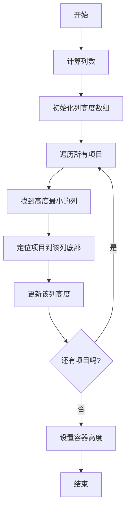

# 瀑布流布局实现思路详解

## 核心思路

瀑布流布局的核心思想是：**等宽不等高**的元素在容器中**动态排列**，形成类似瀑布的流动效果。实现的关键在于：

1. **列式布局**：将容器分为多列
2. **动态定位**：将每个元素放入当前高度最小的列
3. **响应式调整**：根据屏幕尺寸动态调整列数

## 详细实现步骤

### 1. 基本布局结构

```html
<div class="waterfall-container">
  <div class="waterfall-item">内容1</div>
  <div class="waterfall-item">内容2</div>
  <div class="waterfall-item">内容3</div>
  <!-- 更多项目 -->
</div>
```

### 2. 核心算法流程



### 3. JavaScript实现详细步骤

#### 步骤1: 初始化容器和项目

```javascript
class Waterfall {
  constructor(containerSelector, options = {}) {
    // 获取容器元素
    this.container = document.querySelector(containerSelector);
    
    // 获取所有项目
    this.items = Array.from(this.container.children);
    
    // 配置选项
    this.options = {
      columns: 4,          // 默认列数
      gap: 15,             // 项目间距
      responsive: {         // 响应式断点
        1200: 4,
        992: 3,
        768: 2,
        576: 1
      },
      ...options
    };
    
    // 初始化列高度数组
    this.columnHeights = [];
    
    // 初始化
    this.init();
  }
}
```

#### 步骤2: 初始化布局

```javascript
init() {
  // 设置容器为相对定位
  this.container.style.position = 'relative';
  
  // 移除所有项目的内联样式
  this.items.forEach(item => {
    item.style.position = '';
    item.style.top = '';
    item.style.left = '';
  });
  
  // 计算当前列数
  this.currentColumns = this.calculateColumns();
  
  // 初始化列高度数组
  this.columnHeights = new Array(this.currentColumns).fill(0);
  
  // 执行布局
  this.layout();
  
  // 设置事件监听
  this.setupEvents();
}
```

#### 步骤3: 计算响应式列数

```javascript
calculateColumns() {
  const width = window.innerWidth;
  const breakpoints = Object.keys(this.options.responsive)
    .map(Number)
    .sort((a, b) => b - a); // 从大到小排序
  
  for (const breakpoint of breakpoints) {
    if (width >= breakpoint) {
      return this.options.responsive[breakpoint];
    }
  }
  
  return 1; // 默认值
}
```

#### 步骤4: 核心布局算法

```javascript
layout() {
  // 计算列宽度
  const containerWidth = this.container.offsetWidth;
  const columnWidth = (containerWidth - 
                      (this.currentColumns - 1) * this.options.gap) / 
                      this.currentColumns;
  
  // 重置列高度
  this.columnHeights.fill(0);
  
  // 遍历所有项目
  this.items.forEach(item => {
    // 找到高度最小的列
    const minHeight = Math.min(...this.columnHeights);
    const minIndex = this.columnHeights.indexOf(minHeight);
    
    // 设置项目样式
    item.style.position = 'absolute';
    item.style.width = `${columnWidth}px`;
    item.style.left = `${minIndex * (columnWidth + this.options.gap)}px`;
    item.style.top = `${minHeight}px`;
    
    // 更新列高度
    this.columnHeights[minIndex] += item.offsetHeight + this.options.gap;
  });
  
  // 设置容器高度
  this.container.style.height = `${Math.max(...this.columnHeights)}px`;
}
```

#### 步骤5: 事件处理

```javascript
setupEvents() {
  // 窗口大小变化时重新布局
  let resizeTimer;
  window.addEventListener('resize', () => {
    clearTimeout(resizeTimer);
    resizeTimer = setTimeout(() => {
      const newColumns = this.calculateColumns();
      if (newColumns !== this.currentColumns) {
        this.currentColumns = newColumns;
        this.layout();
      }
    }, 300);
  });
  
  // 图片加载完成后重新布局
  const images = this.container.querySelectorAll('img');
  images.forEach(img => {
    if (!img.complete) {
      img.addEventListener('load', () => this.layout());
    }
  });
}
```

#### 步骤6: 添加新项目

```javascript
addItem(content) {
  const item = document.createElement('div');
  item.className = 'waterfall-item';
  item.innerHTML = content;
  this.container.appendChild(item);
  
  // 添加到项目数组
  this.items.push(item);
  
  // 重新布局
  this.layout();
}
```

### 4. 图片处理优化

瀑布流布局中最常见的问题是图片加载导致布局错乱，以下是解决方案：

#### 固定宽高比容器

```css
.waterfall-item {
  position: absolute;
  width: 100%; /* 宽度由JS设置 */
}

.image-container {
  position: relative;
  padding-top: 150%; /* 2:3比例 */
  overflow: hidden;
}

.image-container img {
  position: absolute;
  top: 0;
  left: 0;
  width: 100%;
  height: 100%;
  object-fit: cover;
}
```

#### 预加载图片获取尺寸

```javascript
async function loadImage(url) {
  return new Promise((resolve) => {
    const img = new Image();
    img.onload = () => resolve({
      width: img.width,
      height: img.height
    });
    img.src = url;
  });
}

// 使用
const imageData = await loadImage('image.jpg');
const aspectRatio = imageData.height / imageData.width;
```

#### 图片懒加载

```javascript
function setupLazyLoad() {
  const lazyImages = this.container.querySelectorAll('img[data-src]');
  
  const observer = new IntersectionObserver((entries) => {
    entries.forEach(entry => {
      if (entry.isIntersecting) {
        const img = entry.target;
        img.src = img.dataset.src;
        img.removeAttribute('data-src');
        observer.unobserve(img);
        
        // 图片加载完成后重新布局
        img.onload = () => this.layout();
      }
    });
  }, {
    rootMargin: '0px 0px 200px 0px' // 提前200px加载
  });
  
  lazyImages.forEach(img => observer.observe(img));
}
```

### 5. 性能优化

#### 使用requestAnimationFrame

```javascript
layout() {
  if (this.layoutRequestId) {
    cancelAnimationFrame(this.layoutRequestId);
  }
  
  this.layoutRequestId = requestAnimationFrame(() => {
    // 布局代码...
    this.layoutRequestId = null;
  });
}
```

#### 虚拟滚动（大量项目时）

```javascript
setupVirtualScroll() {
  let lastScrollTop = 0;
  
  this.container.addEventListener('scroll', () => {
    const scrollTop = this.container.scrollTop;
    const direction = scrollTop > lastScrollTop ? 'down' : 'up';
    lastScrollTop = scrollTop;
    
    const viewportHeight = this.container.clientHeight;
    
    this.items.forEach((item, index) => {
      const top = parseInt(item.style.top);
      const height = item.offsetHeight;
      
      // 判断是否在可视区域内
      const isVisible = (
        top < scrollTop + viewportHeight && 
        top + height > scrollTop
      );
      
      if (!isVisible) {
        item.style.display = 'none';
      } else {
        item.style.display = 'block';
      }
    });
  });
}
```

#### 节流和防抖

```javascript
// 防抖函数
function debounce(func, wait) {
  let timeout;
  return function() {
    const context = this;
    const args = arguments;
    clearTimeout(timeout);
    timeout = setTimeout(() => func.apply(context, args), wait);
  };
}

// 在resize事件中使用
window.addEventListener('resize', debounce(() => {
  this.layout();
}, 300));
```

### 6. 动画效果

```css
.waterfall-item {
  transition: transform 0.5s ease, opacity 0.5s ease;
  transform: translateY(30px);
  opacity: 0;
}

.waterfall-item.visible {
  transform: translateY(0);
  opacity: 1;
}
```

```javascript
setupAnimations() {
  const observer = new IntersectionObserver((entries) => {
    entries.forEach(entry => {
      if (entry.isIntersecting) {
        entry.target.classList.add('visible');
        observer.unobserve(entry.target);
      }
    });
  }, {
    threshold: 0.1 // 10%可见时触发
  });
  
  this.items.forEach(item => observer.observe(item));
}
```

### 7. 完整实现代码

```javascript
class Waterfall {
  constructor(containerSelector, options = {}) {
    this.container = document.querySelector(containerSelector);
    this.items = Array.from(this.container.children);
    this.options = {
      columns: 4,
      gap: 15,
      responsive: {
        1200: 4,
        992: 3,
        768: 2,
        576: 1
      },
      ...options
    };
    
    this.layoutRequestId = null;
    this.init();
  }
  
  init() {
    this.container.style.position = 'relative';
    this.currentColumns = this.calculateColumns();
    this.columnHeights = new Array(this.currentColumns).fill(0);
    
    this.layout();
    this.setupEvents();
    this.setupLazyLoad();
    this.setupAnimations();
  }
  
  calculateColumns() {
    const width = window.innerWidth;
    const breakpoints = Object.keys(this.options.responsive)
      .map(Number)
      .sort((a, b) => b - a);
    
    for (const breakpoint of breakpoints) {
      if (width >= breakpoint) {
        return this.options.responsive[breakpoint];
      }
    }
    
    return 1;
  }
  
  layout() {
    if (this.layoutRequestId) {
      cancelAnimationFrame(this.layoutRequestId);
    }
    
    this.layoutRequestId = requestAnimationFrame(() => {
      const containerWidth = this.container.offsetWidth;
      const columnWidth = (containerWidth - 
                         (this.currentColumns - 1) * this.options.gap) / 
                         this.currentColumns;
      
      this.columnHeights.fill(0);
      
      this.items.forEach(item => {
        const minHeight = Math.min(...this.columnHeights);
        const minIndex = this.columnHeights.indexOf(minHeight);
        
        item.style.position = 'absolute';
        item.style.width = `${columnWidth}px`;
        item.style.left = `${minIndex * (columnWidth + this.options.gap)}px`;
        item.style.top = `${minHeight}px`;
        
        this.columnHeights[minIndex] += item.offsetHeight + this.options.gap;
      });
      
      this.container.style.height = `${Math.max(...this.columnHeights)}px`;
      this.layoutRequestId = null;
    });
  }
  
  setupEvents() {
    const debouncedLayout = debounce(() => {
      const newColumns = this.calculateColumns();
      if (newColumns !== this.currentColumns) {
        this.currentColumns = newColumns;
        this.layout();
      }
    }, 300);
    
    window.addEventListener('resize', debouncedLayout);
    
    // 图片加载监听
    const images = this.container.querySelectorAll('img');
    images.forEach(img => {
      if (!img.complete) {
        img.addEventListener('load', () => this.layout());
      }
    });
  }
  
  setupLazyLoad() {
    const lazyImages = this.container.querySelectorAll('img[data-src]');
    
    const observer = new IntersectionObserver((entries) => {
      entries.forEach(entry => {
        if (entry.isIntersecting) {
          const img = entry.target;
          img.src = img.dataset.src;
          img.removeAttribute('data-src');
          observer.unobserve(img);
          
          img.onload = () => this.layout();
        }
      });
    }, {
      rootMargin: '0px 0px 200px 0px'
    });
    
    lazyImages.forEach(img => observer.observe(img));
  }
  
  setupAnimations() {
    const observer = new IntersectionObserver((entries) => {
      entries.forEach(entry => {
        if (entry.isIntersecting) {
          entry.target.classList.add('visible');
          observer.unobserve(entry.target);
        }
      });
    }, {
      threshold: 0.1
    });
    
    this.items.forEach(item => {
      item.classList.add('waterfall-item'); // 确保有动画类
      observer.observe(item);
    });
  }
  
  addItem(content) {
    const item = document.createElement('div');
    item.className = 'waterfall-item';
    item.innerHTML = content;
    this.container.appendChild(item);
    this.items.push(item);
    
    // 添加动画
    item.classList.add('waterfall-item');
    this.setupAnimationsForItem(item);
    
    this.layout();
  }
  
  setupAnimationsForItem(item) {
    const observer = new IntersectionObserver((entries) => {
      entries.forEach(entry => {
        if (entry.isIntersecting) {
          entry.target.classList.add('visible');
          observer.unobserve(entry.target);
        }
      });
    }, {
      threshold: 0.1
    });
    
    observer.observe(item);
  }
}

// 防抖函数
function debounce(func, wait) {
  let timeout;
  return function() {
    const context = this;
    const args = arguments;
    clearTimeout(timeout);
    timeout = setTimeout(() => func.apply(context, args), wait);
  };
}

// 初始化
window.addEventListener('load', () => {
  const waterfall = new Waterfall('.waterfall-container', {
    gap: 20,
    responsive: {
      1400: 5,
      1200: 4,
      992: 3,
      768: 2,
      576: 1
    }
  });
});
```

## 瀑布流布局的最佳实践

1. **图片优化**：
   - 使用固定宽高比容器
   - 实现懒加载
   - 提供低质量图片占位符(LQIP)

2. **性能优化**：
   - 使用虚拟滚动处理大量项目
   - 使用requestAnimationFrame
   - 节流和防抖事件处理

3. **用户体验**：
   - 添加平滑的入场动画
   - 实现无限滚动加载
   - 提供加载状态指示器

4. **响应式设计**：
   - 根据屏幕尺寸调整列数
   - 移动端优先设计
   - 考虑横竖屏切换

5. **错误处理**：
   - 图片加载失败处理
   - 空状态展示
   - 网络错误重试机制

## 总结

瀑布流布局的实现核心在于：

1. **列式布局**：将容器分为多列
2. **动态定位**：将项目放入高度最小的列
3. **高度更新**：更新该列的高度
4. **容器调整**：设置容器高度为最高列的高度

关键优化点：
- **图片处理**：预加载、懒加载、固定宽高比
- **性能优化**：虚拟滚动、RAF、节流防抖
- **用户体验**：平滑动画、无限滚动、响应式设计

通过合理的设计和优化，瀑布流布局可以成为展示大量不规则高度内容的理想选择，尤其适合图片墙、产品列表、内容卡片等场景。