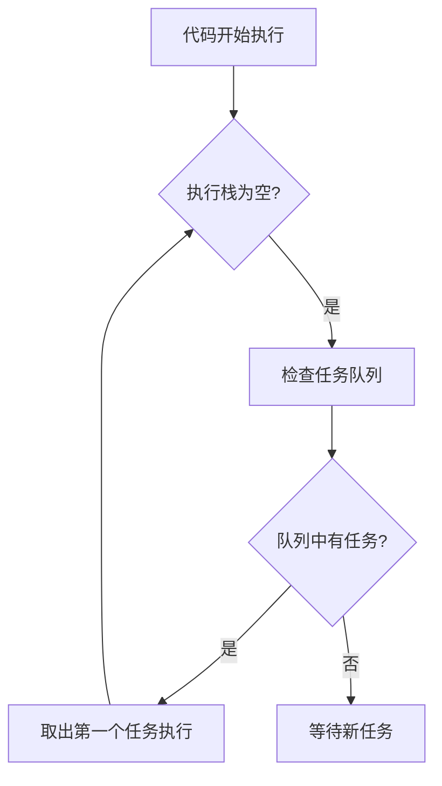

# JavaScript 定时器：setTimeout 与 setInterval 笔记

## 概述

## 基本概念与工作原理

### 事件循环模型

JavaScript 使用单线程事件循环机制管理异步操作：

1. **执行栈**：同步任务的执行位置
2. **任务队列**：存储待执行的回调函数（包括定时器回调）
3. **事件循环**：当执行栈为空时，检查任务队列并执行任务



### 定时器加入队列时机

- **setTimeout(fn, delay)**：在指定延迟后将回调函数加入任务队列
- **setInterval(fn, delay)**：每经过指定延迟时间，就将回调加入任务队列（无论当前是否在执行前一个回调）

JavaScript 提供了两种主要的定时器方法：
- `setTimeout()` - 在指定延迟后执行一次代码
- `setInterval()` - 每隔指定时间重复执行代码

## setTimeout

### 基本语法
```javascript
const timeoutID = setTimeout(function[, delay, arg1, arg2, ...]);
const timeoutID = setTimeout(function[, delay]);
const timeoutID = setTimeout(code[, delay]);
```

### 参数说明
- `function` - 要执行的函数
- `code` - 字符串形式的代码（不推荐使用）
- `delay` - 延迟时间（毫秒），默认0
- `arg1, arg2, ...` - 传递给函数的额外参数

### 使用示例
```javascript
// 基本用法
setTimeout(() => {
  console.log('2秒后执行');
}, 2000);

// 带参数的用法
setTimeout((name, age) => {
  console.log(`姓名: ${name}, 年龄: ${age}`);
}, 1000, '张三', 25);

// 清除定时器
const timer = setTimeout(() => {
  console.log('这段代码不会执行');
}, 3000);

clearTimeout(timer);
```

## setInterval

### 基本语法
```javascript
const intervalID = setInterval(function[, delay, arg1, arg2, ...]);
const intervalID = setInterval(function[, delay]);
const intervalID = setInterval(code[, delay]);
```

### 参数说明
- 与setTimeout参数相同

### 使用示例
```javascript
// 基本用法
let count = 0;
const interval = setInterval(() => {
  count++;
  console.log(`执行了 ${count} 次`);
  
  if (count >= 5) {
    clearInterval(interval);
    console.log('定时器已停止');
  }
}, 1000);

// 带参数的用法
setInterval((message) => {
  console.log(message);
}, 1500, '周期性消息');
```

## 清除定时器

两种定时器都可以被清除：
- `clearTimeout(timeoutID)` - 清除setTimeout定时器
- `clearInterval(intervalID)` - 清除setInterval定时器

```javascript
// 清除setTimeout示例
const timeout = setTimeout(() => {
  console.log('这段代码不会执行');
}, 5000);

// 3秒后取消
setTimeout(() => {
  clearTimeout(timeout);
}, 3000);
```

## 注意事项

1. **延迟时间不是精确的**：JavaScript是单线程的，定时器回调可能会因为其他代码执行而延迟
2. **最小延迟时间**：大多数浏览器的最小延迟是4ms
3. **this指向问题**：在定时器回调中，this默认指向全局对象（浏览器中为window）
4. **性能考虑**：不宜设置过短的时间间隔，避免性能问题

## 实际应用技巧

### 1. 使用函数引用而非字符串
```javascript
// 推荐
setTimeout(myFunction, 1000);

// 不推荐
setTimeout('myFunction()', 1000);
```

### 2. 解决this指向问题
```javascript
const obj = {
  name: '示例',
  startTimer() {
    // 使用箭头函数保持this指向
    setTimeout(() => {
      console.log(this.name); // 正确输出"示例"
    }, 1000);
    
    // 或者使用bind
    setTimeout(function() {
      console.log(this.name);
    }.bind(this), 1000);
  }
};
```

### 3. 确保定时器被清除
```javascript
function startCountdown(seconds) {
  let remaining = seconds;
  
  const interval = setInterval(() => {
    console.log(`剩余: ${remaining}秒`);
    remaining--;
    
    if (remaining < 0) {
      clearInterval(interval);
      console.log('倒计时结束');
    }
  }, 1000);
  
  // 返回清除函数以便外部调用
  return () => clearInterval(interval);
}

const stopCountdown = startCountdown(5);
// 需要时可以调用 stopCountdown() 提前结束
```

### 4. 使用setTimeout模拟setInterval
```javascript
// 更可控的周期性执行
function customInterval(callback, delay) {
  let timeoutId;
  
  const execute = () => {
    callback();
    timeoutId = setTimeout(execute, delay);
  };
  
  timeoutId = setTimeout(execute, delay);
  
  return {
    clear: () => clearTimeout(timeoutId)
  };
}

// 使用示例
const interval = customInterval(() => {
  console.log('自定义间隔执行');
}, 1000);

// 5秒后停止
setTimeout(() => interval.clear(), 5000);
```

## 关键机制：堆叠风险

### 什么是堆叠风险？
当回调函数的执行时间超过setInterval设置的延迟时，会导致回调函数在任务队列中堆积

```javascript
// 堆叠风险示例（执行时间200ms > 间隔100ms）
setInterval(() => {
  console.log('开始执行 ' + new Date().toISOString());
  
  // 模拟长时间操作
  const start = Date.now();
  while (Date.now() - start < 200) {} // 阻塞200ms
  
  console.log('结束执行 ' + new Date().toISOString());
}, 100);
```

### 如何避免堆叠风险？
**递归setTimeout模式**：
```javascript
function safeInterval(callback, delay) {
  // 执行回调
  callback();
  
  // 递归调用setTimeout
  setTimeout(() => {
    safeInterval(callback, delay);
  }, delay);
}

// 启动示例
setTimeout(() => safeInterval(() => {
  console.log('安全执行');
  // 模拟耗时操作
  const start = Date.now();
  while (Date.now() - start < 200) {}
}, 100), 100);
```

## 高级技巧与最佳实践

### 1. this绑定问题解决方案
```javascript
const component = {
  status: '活跃',
  start() {
    // 使用箭头函数保留this
    this.interval = setInterval(() => {
      console.log(this.status); // 正确输出"活跃"
    }, 1000);
    
    // bind方法绑定
    this.timeout = setTimeout(function() {
      console.log(this.status);
    }.bind(this), 2000);
  },
  stop() {
    clearInterval(this.interval);
    clearTimeout(this.timeout);
  }
};
```

### 2. 精确计时方案
```javascript
function preciseInterval(callback, interval) {
  let expected = Date.now() + interval;
  
  function task() {
    const drift = Date.now() - expected;
    
    // 执行回调
    callback();
    
    // 调整下次执行时间
    expected += interval;
    setTimeout(task, Math.max(0, interval - drift));
  }
  
  setTimeout(task, interval);
}

// 使用精确计时器
preciseInterval(() => {
  console.log('精确计时: ', new Date().toISOString());
}, 1000);
```

### 3. 安全清除模式
```javascript
function createTimer() {
  let timeoutId = null;
  let intervalId = null;
  
  return {
    setDelayTask(fn, delay) {
      this.cancel(); // 清除现有定时器
      timeoutId = setTimeout(fn, delay);
    },
    setPeriodicTask(fn, interval) {
      this.cancel();
      intervalId = setInterval(fn, interval);
    },
    cancel() {
      if (timeoutId) clearTimeout(timeoutId);
      if (intervalId) clearInterval(intervalId);
      timeoutId = intervalId = null;
    }
  };
}

// 使用示例
const timerControl = createTimer();
timerControl.setPeriodicTask(() => {
  console.log('周期性任务');
}, 1000);

// 需要时取消所有定时器
setTimeout(() => timerControl.cancel(), 5000);
```


## 常见问题解析

### 1. 为什么定时器不够精确？
JavaScript的单线程模型导致定时器回调只能在执行栈清空后运行：
```javascript
// 主线程阻塞影响示例
const start = Date.now();
setTimeout(() => {
  console.log(`实际延迟: ${Date.now() - start}ms`);
}, 100);

// 长阻塞操作
while (Date.now() - start < 500) {}
// 输出: 实际延迟: 约500ms
```

### 2. 最小延迟限制
浏览器通常有最小延迟限制：
- 现代浏览器：4ms
- 嵌套定时器：≥4ms
```javascript
// 实际延迟测试
const start = Date.now();
setTimeout(() => {
  console.log(`实际延迟: ${Date.now() - start}ms`);
}, 0);
// 输出: 实际延迟: 4-10ms
```

### 3. 后台标签页限制
浏览器会限制后台标签页的定时器：
- 最小间隔增加到1000ms
- 部分浏览器暂停所有定时器

### 4. 误差累积问题及解决
`setInterval`会产生累积误差：
```javascript
// 递归setTimeout解决误差累积
function accurateTimer(fn, interval) {
  let start = Date.now();
  
  function execute() {
    fn();
    // 基于实际时间计算下一个执行点
    start += interval;
    const nextTime = start - Date.now();
    setTimeout(execute, Math.max(0, nextTime));
  }
  
  setTimeout(execute, interval);
}
```

## 总结对比

| 特性 | setTimeout | setInterval |
|------|------------|-------------|
| 执行次数 | 一次 | 多次 |
| 返回值 | 定时器ID | 定时器ID |
| 清除方法 | clearTimeout | clearInterval |
| 适用场景 | 延迟执行、防抖 | 轮询、动画 |

## 常见问题

1. **定时器嵌套**：在setTimeout回调中再次调用setTimeout比setInterval更精确
2. **页面不可见时的行为**：大多数浏览器会降低非可见页面的定时器执行频率
3. **误差累积**：setInterval可能因执行时间导致误差累积，setTimeout递归调用可避免此问题

这些是JavaScript定时器的主要知识点，掌握它们对开发复杂的交互和异步操作非常重要。