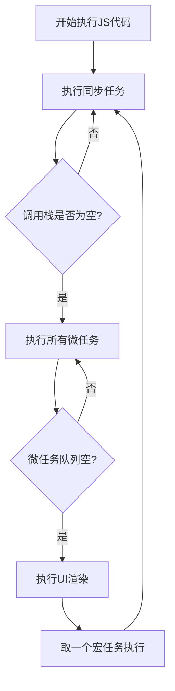

# JavaScript 事件循环机制 - 完整学习笔记

## 一、什么是事件循环？

### 1.1 核心概念
**事件循环（Event Loop）** 是 JavaScript 的运行时执行模型，它允许单线程的 JavaScript 处理异步操作和非阻塞 I/O。

### 1.2 核心组成部分
- **调用栈（Call Stack）**：执行同步代码的栈结构（后进先出）
- **任务队列（Task Queue）**：存储待执行的回调函数
- **Web APIs**：浏览器提供的异步功能接口
- **事件循环机制**：协调调用栈和任务队列的工作流程

### 1.3 简单示例
```javascript
console.log('开始执行'); // 同步代码，直接进入调用栈

setTimeout(() => {
  console.log('异步回调'); // 异步任务，通过事件循环处理
}, 0);

console.log('执行结束'); // 同步代码
```

## 二、为什么要有事件循环？

### 2.1 解决单线程限制
JavaScript 设计为单线程语言，但需要处理多种场景：
- 用户交互事件（点击、滚动、输入）
- 网络请求与资源加载
- 定时和延迟任务
- 文件操作（Node.js环境）

### 2.2 避免阻塞主线程
```javascript
// 阻塞式示例（避免使用）
function blockingOperation() {
  const start = Date.now();
  while (Date.now() - start < 3000) {
    // 模拟3秒阻塞操作
  }
  console.log('阻塞操作完成');
}

// 非阻塞式示例（推荐使用）
function nonBlockingOperation() {
  setTimeout(() => {
    console.log('异步操作完成');
  }, 3000);
}
```

### 2.3 实现高效并发
通过事件循环，JavaScript 可以在等待 I/O 操作时继续处理其他任务，大大提高程序效率。

### 2.4保持界面的响应性
DOM更新，事件监听不中断

### 2.5支持异步编程模型
Promise/async/await
setTimeout,fetch 

## 三、宏任务 vs 微任务

### 3.1 宏任务（Macrotasks）
| 特性 | 说明 |
|------|------|
| **定义** | 每个事件循环周期执行一个的任务 |
| **常见类型** | setTimeout、setInterval、I/O操作、UI渲染 |
| **执行时机** | 主线程空闲时，从队列中取出执行 |

### 3.2 微任务（Microtasks）
| 特性 | 说明 |
|------|------|
| **定义** | 在每个宏任务执行后立即执行的任务 |
| **常见类型** | Promise回调、MutationObserver、process.nextTick |
| **执行时机** | 当前宏任务执行完后立即执行所有微任务 |

### 3.3 优先级规则
1. **同步代码 > 微任务 > 宏任务**

2. process.nextTick > Promise > 其他微任务

3. 同类型任务按队列顺序执行（先进先出）

1.同步代码优先执行，然后是微任务，最后是宏任务

2.​微任务队列清空后才会执行下一个宏任务

3.避免长时间同步任务阻塞事件循环

4.合理选择任务类型优化性能

## 四、事件循环的执行顺序

### 4.1 完整执行流程



### 4.2 代码执行分析
```javascript
console.log('1: 同步任务');

setTimeout(() => {
  console.log('2: 宏任务 - setTimeout');
}, 0);

Promise.resolve().then(() => {
  console.log('3: 微任务 - Promise');
});

console.log('4: 同步任务结束');

// 输出顺序：
// 1: 同步任务
// 4: 同步任务结束
// 3: 微任务 - Promise
// 2: 宏任务 - setTimeout
```

### 4.3 复杂场景示例
```javascript
console.log('脚本开始');

setTimeout(() => {
  console.log('宏任务1');
  Promise.resolve().then(() => {
    console.log('微任务 in 宏任务1');
  });
}, 0);

Promise.resolve().then(() => {
  console.log('微任务1');
});

console.log('脚本结束');

/* 输出顺序：
脚本开始
脚本结束
微任务1
宏任务1
微任务 in 宏任务1
*/
```

## 五、Node.js 环境的差异点

### 5.1 事件循环阶段划分
Node.js 事件循环分为六个阶段：
1. **timers**：执行 setTimeout 和 setInterval 回调
2. **pending callbacks**：执行系统操作的回调
3. **idle, prepare**：内部使用阶段
4. **poll**：检索新的 I/O 事件
5. **check**：执行 setImmediate 回调
6. **close callbacks**：执行关闭事件回调

### 5.2 特殊 API 和行为
```javascript
// Node.js 特有行为示例
console.log('开始');

setTimeout(() => console.log('setTimeout'), 0);
setImmediate(() => console.log('setImmediate'));
process.nextTick(() => console.log('nextTick'));

Promise.resolve().then(() => console.log('Promise'));

console.log('结束');

/* 典型输出顺序：
开始
结束
nextTick
Promise
setTimeout
setImmediate
*/
```

### 5.3 重要差异总结
| 特性 | 浏览器环境 | Node.js 环境 |
|------|------------|--------------|
| **微任务执行** | 宏任务之后 | 各阶段之间 |
| **最高优先级** | Promise | process.nextTick |
| **渲染处理** | 包含UI渲染 | 无UI渲染 |
| **API支持** | requestAnimationFrame | setImmediate |

## 六、实战应用与最佳实践

### 6.1 避免阻塞事件循环
```javascript
// 错误示例：长时间同步任务
function processData(data) {
  // 可能阻塞事件循环
  for (let i = 0; i < data.length; i++) {
    // 复杂计算...
  }
}

// 正确示例：任务分片
function processInChunks(data, chunkSize, callback) {
  let index = 0;
  
  function processChunk() {
    const chunk = data.slice(index, index + chunkSize);
    // 处理数据分片
    
    index += chunkSize;
    if (index < data.length) {
      setTimeout(processChunk, 0); // 让出控制权
    } else {
      callback();
    }
  }
  
  processChunk();
}
```

### 6.2 合理选择任务类型
```javascript
// 微任务适合：状态更新、Promise链
function updateState(data) {
  Promise.resolve().then(() => {
    // 立即更新但不会阻塞渲染
    applicationState = data;
  });
}

// 宏任务适合：用户交互、动画效果
function handleUserInteraction() {
  setTimeout(() => {
    // 处理交互逻辑
    animateElement(element);
  }, 0);
}
```

## 总结

事件循环是 JavaScript 异步编程的核心机制，理解其工作原理对于编写高效、非阻塞的代码至关重要。关键要点：

1. **同步代码优先执行**，然后是微任务，最后是宏任务
2. **微任务队列清空后**才会执行下一个宏任务
3. **避免长时间同步任务**阻塞事件循环
4. **合理选择任务类型**优化性能

掌握事件循环机制将帮助您编写出更高效、响应更快的 JavaScript 应用程序。