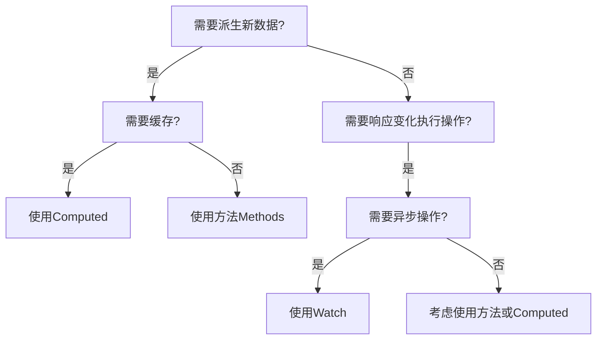

# Vue Computed 与 Watch 核心对比与最佳实践指南

## 一、核心概念对比

| 特性               | Computed (计算属性)                          | Watch (侦听器)                              |
|--------------------|---------------------------------------------|---------------------------------------------|
| **本质**           | 声明式衍生数据                               | 命令式副作用监听                            |
| **使用场景**       | 模板中需要复杂逻辑处理的数据                 | 数据变化时需要执行异步操作或复杂业务逻辑      |
| **返回值**         | 必须返回一个值                              | 无返回值                                    |
| **缓存机制**       | 有缓存（依赖不变不重新计算）                 | 无缓存（每次变化都执行）                    |
| **异步支持**       | 不支持                                      | 支持                                        |
| **立即执行**       | 首次访问时自动计算                          | 默认不立即执行（可配置 immediate）          |
| **多个依赖**       | 自动追踪所有依赖                            | 需手动指定侦听目标                          |
| **代码风格**       | 声明式                                      | 命令式                                      |

---

## 二、Computed 深度解析

### 1. 核心特性
```javascript
computed: {
  fullName() {
    return this.firstName + ' ' + this.lastName;
  },
  
  // 带 setter 的计算属性
  reversedMessage: {
    get() {
      return this.message.split('').reverse().join('');
    },
    set(newValue) {
      this.message = newValue.split('').reverse().join('');
    }
  }
}
```

### 2. 原理机制
1. **依赖追踪**：首次计算时记录所有响应式依赖
2. **缓存机制**：依赖未变化时直接返回缓存值
3. **惰性求值**：只有被访问时才进行计算
4. **更新触发**：依赖变化时将计算属性标记为"dirty"，下次访问时重新计算

### 3. 最佳实践场景
- 格式化显示数据（日期、货币）
- 复杂数据过滤/排序
- 从 store 中派生状态
- 多数据源组合计算
```javascript
// 购物车总价计算
computed: {
  totalPrice() {
    return this.cartItems.reduce((sum, item) => {
      return sum + item.price * item.quantity;
    }, 0);
  }
}
```

---

## 三、Watch 深度解析

### 1. 核心语法
```javascript
watch: {
  // 基本形式
  question(newVal, oldVal) {
    this.getAnswer();
  },
  
  // 深度监听对象
  user: {
    handler(newVal, oldVal) {
      console.log('用户信息变化');
    },
    deep: true, // 深度监听
    immediate: true // 立即执行
  },
  
  // 监听特定路径
  'user.name': {
    handler(newName) {
      this.validateName(newName);
    }
  },
  
  // 多源监听
   {
    this.fetchData();
  }
}
```

### 2. 原理机制
1. **依赖收集**：创建时收集指定依赖
2. **变化检测**：依赖变化时执行回调
3. **清理机制**：组件卸载时自动取消侦听

### 3. 最佳实践场景
- API请求（搜索建议）
- 表单验证
- 路由参数变化响应
- 执行异步操作
```javascript
// 搜索建议实现
watch: {
  searchQuery(newQuery) {
    if (this.timer) clearTimeout(this.timer);
    this.timer = setTimeout(() => {
      this.fetchSuggestions(newQuery);
    }, 300);
  }
}
```

---

## 四、Computed vs Watch 选择指南

### 决策流程图


### 经典场景对比
| 场景                 | Computed | Watch | 说明 |
|----------------------|----------|-------|------|
| 用户名显示           | ✅        | ❌     | 声明式派生数据 |
| 表单字段验证         | ❌        | ✅     | 变化时需要额外操作 |
| 购物车总价计算       | ✅        | ❌     | 依赖多个数据项 |
| 路由参数变化加载数据 | ❌        | ✅     | 需要执行异步请求 |
| 富文本编辑器内容处理 | ✅        | ❌     | 内容格式化显示 |

---

## 五、Vue 3 组合式API写法

### 1. Computed 使用
```javascript
import { computed, ref } from 'vue';

export default {
  setup() {
    const count = ref(0);
    
    // 只读计算属性
    const double = computed(() => count.value * 2);
    
    // 可写计算属性
    const plusOne = computed({
      get: () => count.value + 1,
      set: val => { count.value = val - 1 }
    });
    
    return { double, plusOne };
  }
}
```

### 2. Watch 使用
```javascript
import { watch, ref } from 'vue';

export default {
  setup() {
    const searchQuery = ref('');
    const results = ref([]);
    
    // 基本监听
    watch(searchQuery, (newVal) => {
      fetchResults(newVal);
    });
    
    // 监听多个源
    watch([firstName, lastName], ([newFirst, newLast]) => {
      console.log(`名字变化: ${newFirst} ${newLast}`);
    }, { immediate: true });
    
    // 对象深度监听
    watch(user, (newUser) => {
      saveUser(newUser);
    }, { deep: true });
    
    return { searchQuery, results };
  }
}
```

### 3. watchEffect 高级用法
```javascript
import { watchEffect, ref } from 'vue';

setup() {
  const count = ref(0);
  
  // 自动追踪依赖
  const stop = watchEffect((onInvalidate) => {
    console.log(`计数: ${count.value}`);
    
    // 清理副作用
    onInvalidate(() => {
      clearTimeout(timer);
    });
    
    // 异步示例
    const timer = setTimeout(() => {
      /* ... */
    }, 1000);
  });
  
  // 手动停止侦听
  const stopWatching = () => stop();
}
```

---

## 六、性能优化与陷阱规避

### 1. Computed 优化
- **避免副作用**：不在计算属性中修改状态
- **减少依赖**：拆分复杂计算为多个计算属性
- **缓存利用**：依赖不变时不重复计算

### 2. Watch 优化
- **避免深度监听**：优先使用特定路径监听
```javascript
// 不推荐
watch(obj, handler, { deep: true })

// 推荐
watch(() => obj.key, handler)
```
- **防抖处理**：高频操作使用防抖
```javascript
watch(query, debounce((newVal) => {
  search(newVal);
}, 500))
```
- **及时清理**：组件卸载时清理异步操作

### 3. 常见陷阱
1. **修改监听的数据导致循环更新**
```javascript
watch: {
  value(newVal) {
    // 错误：可能导致无限循环
    this.value = newVal.trim();
  }
}
```

2. **忽略异步操作的竞态条件**
```javascript
watch(id, async (newId) => {
  // 可能后发请求先返回结果
  const data = await fetchData(newId);
  this.data = data;
})
```

3. **过度使用深度监听导致性能问题**
```javascript
// 大型对象深度监听可能造成性能瓶颈
watch(bigObject, handler, { deep: true })
```

---

## 七、总结对比表

| 维度             | Computed                     | Watch                        | WatchEffect                 |
|------------------|------------------------------|------------------------------|-----------------------------|
| **目的**         | 派生数据                     | 响应变化执行操作             | 自动追踪依赖执行副作用      |
| **返回值**       | 有                           | 无                           | 无                          |
| **缓存**         | ✅                            | ❌                            | ❌                           |
| **立即执行**     | 访问时执行                   | 可配置 immediate             | 立即执行                    |
| **依赖收集**     | 自动                         | 手动指定                     | 自动                        |
| **异步支持**     | ❌                            | ✅                            | ✅                           |
| **典型场景**     | 模板数据准备                 | 数据变化响应                 | 副作用管理                  |
| **Vue3写法**     | computed()                   | watch()                      | watchEffect()               |
| **清理机制**     | 自动                         | 自动/手动停止                | 返回停止函数                |

**黄金法则**：
- 当需要基于现有状态**计算新值** → 使用 `computed`
- 当需要在状态变化时**执行操作** → 使用 `watch`
- 当需要自动追踪依赖**执行副作用** → 使用 `watchEffect`

掌握这些核心差异和使用场景，将帮助您构建更高效、更易维护的 Vue 应用程序。