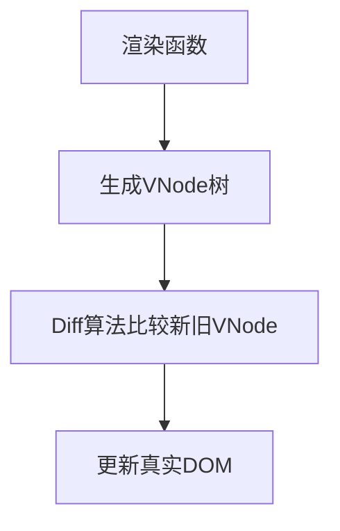

# Vue 模板编译原理：从 Template 到 Render 函数

Vue 将模板(template)转换为渲染函数(render function)的过程是其核心功能之一，这个过程称为**模板编译**。以下是完整的转换流程：

## 一、整体编译流程

```
模板字符串 → 解析器 → 抽象语法树(AST) → 优化器 → 优化后AST → 代码生成器 → 渲染函数
```

## 二、详细步骤解析

### 1. 解析阶段：模板 → AST

**过程**：
- 使用解析器将模板字符串转换为抽象语法树(AST)
- 识别模板中的各种语法结构：
  - 元素节点（HTML标签）
  - 属性节点（指令、普通属性）
  - 文本节点（纯文本）
  - 插值表达式（`{{ }}`）
  - 指令（`v-if`, `v-for`等）

**示例模板**：
```html
<div id="app">
  <p>{{ message }}</p>
  <button @click="handleClick">Click</button>
</div>
```

**生成的AST结构**：
```javascript
{
  type: 1, // 元素节点
  tag: 'div',
  attrsList: [{name: 'id', value: 'app'}],
  children: [
    {
      type: 1,
      tag: 'p',
      children: [{
        type: 2, // 表达式节点
        expression: '_s(message)',
        text: '{{ message }}'
      }]
    },
    {
      type: 1,
      tag: 'button',
      events: {
        click: {value: 'handleClick'}
      },
      children: [{type: 3, text: 'Click'}] // 纯文本节点
    }
  ]
}
```

### 2. 优化阶段：标记静态节点

**目的**：
- 遍历AST，标记静态节点和静态根节点
- 在后续更新中跳过这些节点的比对，提高性能

**优化规则**：
1. 没有动态绑定（`v-bind`, `v-for`等）
2. 没有`v-if`/`v-for`指令
3. 没有插值表达式
4. 子节点也都是静态的

### 3. 代码生成阶段：AST → Render函数

**核心方法**：
- 递归遍历AST节点
- 为每种节点类型生成对应的创建函数：
  - 元素节点 → `_c(tag, data, children)`
  - 文本节点 → `_v(text)`
  - 插值表达式 → `_s(value)`

**生成结果**：
```javascript
with(this) {
  return _c('div', {attrs: {"id":"app"}}, [
    _c('p', [_v(_s(message))]),
    _c('button', {on: {"click": handleClick}}, [_v("Click")])
  ])
}
```

### 4. 关键辅助函数说明

| 函数名 | 别名 | 作用 |
|--------|------|------|
| `createElement` | `_c` | 创建VNode节点 |
| `createTextVNode` | `_v` | 创建文本节点 |
| `toString` | `_s` | 将值转换为字符串 |
| `renderList` | `_l` | 处理v-for列表渲染 |
| `resolveFilter` | `_f` | 处理过滤器 |

## 三、运行时执行流程

1. 执行渲染函数，返回虚拟DOM树(VNode)
2. 将VNode与旧VNode进行diff比较
3. 将变化应用到真实DOM



## 四、编译时机与模式

### 1. 运行时编译（开发环境）
- 在浏览器中实时编译模板
- 需要包含完整版Vue（包含编译器）
- 性能开销较大

### 2. 预编译（生产环境推荐）
- 使用vue-loader在构建时编译
- 生成纯渲染函数
- 减小包体积，提高性能

```javascript
// 预编译后的组件
export default {
  render(h) {
    return h('div', {attrs: {id: 'app'}}, [
      h('p', this.message),
      h('button', {on: {click: this.handleClick}}, 'Click')
    ])
  }
}
```

## 五、特殊指令处理

### v-if 的转换
```html
<div v-if="show">Content</div>
```
↓ 转换为 ↓
```javascript
show ? _c('div', [_v("Content")]) : _e()
```

### v-for 的转换
```html
<li v-for="item in items" :key="item.id">{{ item.name }}</li>
```
↓ 转换为 ↓
```javascript
_l((items), function(item) { 
  return _c('li', {key: item.id}, [_v(_s(item.name))])
})
```

## 六、性能优化技巧

1. **避免过度嵌套**：减少DOM层级
2. **合理使用v-show/v-if**：
   - 频繁切换用v-show
   - 条件稳定用v-if
3. **key的合理使用**：
   ```html
   <!-- 推荐使用唯一ID -->
   <div v-for="item in list" :key="item.id">
   ```
4. **避免v-if和v-for同时使用**
5. **组件懒加载**：
   ```javascript
   const LazyComponent = () => import('./LazyComponent.vue')
   ```

## 总结

Vue的模板编译是一个将声明式模板转换为可执行渲染函数的过程：
1. **解析**：模板 → AST
2. **优化**：标记静态节点
3. **生成**：AST → 渲染函数
4. **执行**：渲染函数 → VNode → DOM更新

理解这个过程有助于：
- 编写更高效的模板
- 优化应用性能
- 深入理解Vue响应式原理
- 在需要时直接使用渲染函数