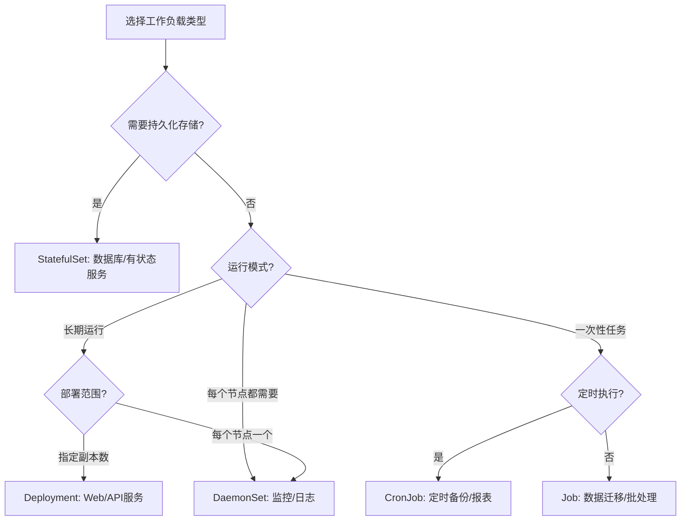

# Kubernetes 工作负载类型全面解析

## 1. 核心分类维度

Kubernetes 的工作负载可以从**多个维度**进行分类：

| 分类维度 | 类型 | 说明 |
|---------|------|------|
| **数据状态** | 无状态 vs 有状态 | 是否需要持久化存储和稳定标识 |
| **运行模式** | 长期运行 vs 批处理任务 | 持续运行还是一次性执行 |
| **部署范围** | 全局部署 vs 副本部署 | 每个节点部署还是指定数量副本 |
| **运行时机** | 立即执行 vs 定时执行 | 随时运行还是按计划运行 |

## 2. 详细的工作负载类型

### 2.1 按**数据状态**分类

#### 1) 无状态服务（Stateless Services）
**特点**：
- 不保存持久化数据或状态
- 实例之间完全等价、可互换
- 请求可以在任意实例间负载均衡
- 故障恢复简单快速

**Kubernetes 控制器**：**Deployment** + **ReplicaSet**

```yaml
# 典型无状态服务：Web服务器、API网关
apiVersion: apps/v1
kind: Deployment
metadata:
  name: web-frontend
spec:
  replicas: 3  # 任意3个相同实例
  selector:
    matchLabels:
      app: web
  template:
    metadata:
      labels:
        app: web
    spec:
      containers:
      - name: nginx
        image: nginx:latest
        # 无持久化存储，无特殊身份标识
```

**适用场景**：
- Web 应用前端
- API 网关
- 无状态微服务
- 计算密集型任务

#### 2) 有状态服务（Stateful Services）  
**特点**：
- 需要持久化存储数据
- 实例有唯一稳定的网络标识
- 实例之间不等价，可能有主从关系
- 需要有序的部署和扩展

**Kubernetes 控制器**：**StatefulSet**

```yaml
# 典型有状态服务：数据库、消息队列
apiVersion: apps/v1
kind: StatefulSet
metadata:
  name: mysql-cluster
spec:
  serviceName: "mysql"  # 必须有对应的Headless Service
  replicas: 3
  selector:
    matchLabels:
      app: mysql
  template:
    metadata:
      labels:
        app: mysql
    spec:
      containers:
      - name: mysql
        image: mysql:8.0
        volumeMounts:
        - name: data
          mountPath: /var/lib/mysql
  volumeClaimTemplates:  # 每个Pod独立的持久化存储
  - metadata:
      name: data
    spec:
      accessModes: ["ReadWriteOnce"]
      storageClassName: "ssd"
      resources:
        requests:
          storage: 20Gi
```

**适用场景**：
- 数据库（MySQL、PostgreSQL、MongoDB）
- 消息队列（Kafka、RabbitMQ）
- 分布式缓存（Redis Cluster）
- 有状态中间件

### 2.2 按**运行模式**分类

#### 3) 长期运行服务（Long-running Services）
**特点**：
- 7x24小时持续运行
- 需要高可用性和自动恢复
- 支持水平扩展

**Kubernetes 控制器**：**Deployment**、**StatefulSet**、**DaemonSet**

```yaml
# 长期运行的监控代理（每个节点一个）
apiVersion: apps/v1
kind: DaemonSet
metadata:
  name: node-monitor
spec:
  selector:
    matchLabels:
      app: monitor
  template:
    metadata:
      labels:
        app: monitor
    spec:
      containers:
      - name: agent
        image: monitoring-agent:latest
        # 在每个节点上长期运行监控
```

#### 4) 批处理任务（Batch Jobs）
**特点**：
- 执行一次性任务，完成后退出
- 关注任务是否成功完成
- 可以控制并行度和重试策略

**Kubernetes 控制器**：**Job**

```yaml
# 批处理任务：数据导入、报表生成
apiVersion: batch/v1
kind: Job
metadata:
  name: data-import
spec:
  completions: 5     # 需要完成5个任务
  parallelism: 2     # 同时运行2个任务
  backoffLimit: 3    # 失败重试3次
  template:
    spec:
      containers:
      - name: importer
        image: data-importer:latest
        command: ["/bin/import-data.sh"]
      restartPolicy: OnFailure  # 失败时重启容器
```

#### 5) 定时任务（Scheduled Jobs）
**特点**：
- 按照时间表定期执行
- 基于 Cron 表达式
- 本质上是通过 Job 控制器实现

**Kubernetes 控制器**：**CronJob**

```yaml
# 定时任务：每天备份、定期清理
apiVersion: batch/v1
kind: CronJob
metadata:
  name: daily-backup
spec:
  schedule: "0 2 * * *"  # 每天凌晨2点执行
  startingDeadlineSeconds: 300  # 最晚开始时间
  concurrencyPolicy: Forbid     # 禁止并发执行
  jobTemplate:
    spec:
      template:
        spec:
          containers:
          - name: backup
            image: backup-tool:latest
            args:
            - --source=/data
            - --destination=/backup
          restartPolicy: OnFailure
```

### 2.3 按**部署范围**分类

#### 6) 副本部署（Replicated Deployment）
**特点**：
- 部署指定数量的相同副本
- 可以跨节点分布
- 支持弹性伸缩

**Kubernetes 控制器**：**Deployment**、**ReplicaSet**

```yaml
apiVersion: apps/v1
kind: Deployment
metadata:
  name: api-service
spec:
  replicas: 5  # 部署5个副本，可以分布在多个节点
  selector:
    matchLabels:
      app: api
  template:
    metadata:
      labels:
        app: api
    spec:
      containers:
      - name: api
        image: my-api:latest
```

#### 7) 全局部署（Global Deployment）
**特点**：
- 在**每个节点**上都部署一个副本
- 新节点加入时自动部署
- 适合节点级别的服务

**Kubernetes 控制器**：**DaemonSet**

```yaml
apiVersion: apps/v1
kind: DaemonSet
metadata:
  name: log-collector
spec:
  selector:
    matchLabels:
      app: fluentd
  template:
    metadata:
      labels:
        app: fluentd
    spec:
      tolerations:  # 容忍所有污点，确保每个节点都运行
      - operator: Exists
      containers:
      - name: fluentd
        image: fluent/fluentd:latest
        # 每个节点都需要日志收集器
```

### 2.4 特殊类型的工作负载

#### 8) 初始化任务（Init Containers）
**特点**：
- 在应用容器启动前运行
- 按顺序执行，全部成功后启动主容器
- 用于准备工作（数据库迁移、依赖检查等）

```yaml
apiVersion: v1
kind: Pod
metadata:
  name: my-app
spec:
  initContainers:
  - name: init-db
    image: busybox:latest
    command: ['sh', '-c', 'until nslookup mysql-service; do echo waiting for mysql; sleep 2; done;']
  - name: run-migrations
    image: db-migrator:latest
    command: ['/bin/run-migrations.sh']
  containers:
  - name: app
    image: my-app:latest
    # 主应用容器
```

#### 9) 临时任务（Ephemeral Containers）
**特点**：
- 用于调试运行的 Pod
- 可以临时加入运行中的 Pod
- 不重启原有容器

```bash
# 调试命令示例
kubectl debug -it my-pod --image=busybox --target=my-app
```

## 3. 工作负载选择指南

### 决策流程图


### 具体场景选择

| 业务场景 | 推荐工作负载 | 原因 |
|---------|------------|------|
| **Web 应用** | Deployment | 无状态，需要多副本负载均衡 |
| **移动端 API** | Deployment | 无状态，弹性伸缩需求 |
| **数据库集群** | StatefulSet | 有状态，需要持久化存储和稳定标识 |
| **消息队列** | StatefulSet | 有状态，消息需要持久化 |
| **日志收集** | DaemonSet | 每个节点都需要运行 |
| **节点监控** | DaemonSet | 监控每个节点的状态 |
| **数据批处理** | Job | 一次性任务，完成后退出 |
| **每日报表** | CronJob | 定时执行的数据处理 |
| **数据库迁移** | Job | 应用启动前的初始化任务 |
| **服务网格边车** | DaemonSet/Deployment | 依赖具体部署需求 |

## 4. 高级工作负载模式

### 4.1 Operator 模式（有状态应用的进阶管理）
对于复杂的有状态应用，可以使用 Operator：

```yaml
# 使用 Elasticsearch Operator 的示例
apiVersion: elasticsearch.k8s.elastic.co/v1
kind: Elasticsearch
metadata:
  name: quickstart
spec:
  version: 8.4.0
  nodeSets:
  - name: default
    count: 3
    config:
      node.store.allow_mmap: false
```

### 4.2 工作队列模式（Job 的进阶用法）
```yaml
# 使用工作队列的并行 Job
apiVersion: batch/v1
kind: Job
metadata:
  name: parallel-worker
spec:
  parallelism: 5    # 同时运行5个worker
  completions: 20   # 总共处理20个任务
  template:
    spec:
      containers:
      - name: worker
        image: worker-image:latest
        env:
        - name: QUEUE_URL
          value: "redis://queue-service:6379"
      restartPolicy: OnFailure
```

## 5. 总结对比表

| 工作负载类型 | 控制器 | 数据状态 | 运行模式 | 典型场景 |
|------------|--------|----------|----------|----------|
| **无状态服务** | Deployment | 无状态 | 长期运行 | Web应用、API服务 |
| **有状态服务** | StatefulSet | 有状态 | 长期运行 | 数据库、消息队列 |
| **批处理任务** | Job | 无状态 | 一次性 | 数据迁移、批量计算 |
| **定时任务** | CronJob | 无状态 | 周期性 | 备份、报表生成 |
| **节点服务** | DaemonSet | 混合 | 长期运行 | 监控、日志收集 |
| **初始化任务** | Init容器 | 无状态 | 一次性 | 数据库迁移、依赖检查 |

**核心选择原则**：
1. **先判断是否需要持久化数据** → 决定用 Deployment 还是 StatefulSet
2. **再判断运行模式** → 长期运行用 Deployment/StatefulSet，一次性用 Job/CronJob  
3. **最后判断部署范围** → 指定副本数用 Deployment，每个节点都用 DaemonSet

这种分类方式能帮助您根据业务需求选择最合适的 Kubernetes 工作负载类型！