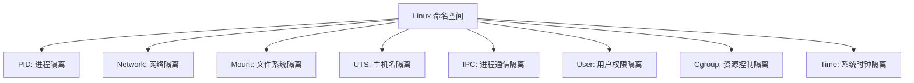

好的，我们来详细、系统地说明 Linux 内核中实现的**每一种命名空间**的作用、隔离机制和使用场景。

## Linux 命名空间全面详解

Linux 命名空间是容器技术的基石，它们提供了**资源隔离**和**虚拟化**的能力。每种命名空间隔离一种特定的系统资源。



---

## 1. PID 命名空间 - 进程隔离

### 核心作用
**隔离进程 ID（PID）编号空间**，使每个命名空间都有自己独立的进程树和 PID 编号。

### 技术细节
- **进程 ID 虚拟化**：不同命名空间中的进程可以有相同的 PID
- **独立的 init 进程**：每个 PID 命名空间都有自己的 PID 1（init 进程）
- **进程树嵌套**：父命名空间可以看到子命名空间的所有进程，但子命名空间只能看到自己的进程

### 实际示例
```bash
# 在宿主机上查看进程
ps aux
PID   USER    COMMAND
1     root    systemd          # 系统 init 进程
1000  root    containerd       # 容器运行时
1005  root    ├─nginx          # 容器内进程（在宿主机视角）

# 进入容器内部查看（不同的 PID 命名空间）
docker exec -it mycontainer ps aux
PID   USER    COMMAND
1     root    nginx            # 容器内的 init 进程
5     root    crond            # 容器内的其他进程
```

### 在容器中的表现
```bash
# 容器内看到的进程树很"干净"
ps aux
PID   USER    COMMAND
1     root    nginx
10    root    sshd
15    root    crond

# 实际上在宿主机上这些进程有真实的 PID
ps aux | grep nginx
1005  root    nginx  # 真实的宿主机 PID
```

### 使用场景
- **容器隔离**：每个容器有独立的进程视图
- **安全增强**：容器内无法看到宿主机进程
- **进程管理**：容器内可以运行 init 进程（PID 1）

---

## 2. 网络命名空间 - 网络隔离

### 核心作用
**隔离网络设备、IP 地址、端口、路由表、防火墙规则**，提供独立的网络栈。

### 技术细节
- **独立的网络设备**：每个命名空间有自己的 lo、eth0 等虚拟设备
- **独立的 IP 地址空间**：不同命名空间可以有相同的 IP 地址
- **独立的端口空间**：每个命名空间都可以使用 1-65535 的全部端口范围
- **隔离的路由表和 iptables 规则**

### 实际示例
```bash
# 宿主机网络设备
ip addr show
1: lo: <LOOPBACK,UP> mtu 65536
2: eth0: <BROADCAST> 192.168.1.100/24
3: docker0: <BROADCAST> 172.17.0.1/16

# 容器内网络设备（不同的网络命名空间）
docker exec -it mycontainer ip addr show
1: lo: <LOOPBACK,UP> mtu 65536
15: eth0@if16: <BROADCAST> 172.17.0.2/16
```

### 网络命名空间创建过程
```bash
# 1. 创建新的网络命名空间
ip netns add mynetns

# 2. 在命名空间内创建虚拟网卡对
ip link add veth0 type veth peer name veth1

# 3. 将一端移到新命名空间
ip link set veth1 netns mynetns

# 4. 配置 IP 地址
ip netns exec mynetns ip addr add 10.0.0.1/24 dev veth1
ip netns exec mynetns ip link set veth1 up
```

### 使用场景
- **容器网络**：每个容器有独立的网络栈
- **网络虚拟化**：模拟多个独立的主机环境
- **网络测试**：隔离的网络环境进行测试

---

## 3. 挂载命名空间 - 文件系统隔离

### 核心作用
**隔离文件系统挂载点**，每个命名空间有独立的文件系统视图和挂载表。

### 技术细节
- **独立的挂载点树**：挂载/卸载操作只影响当前命名空间
- **挂载传播控制**：可以设置挂载事件的传播方式（共享、从属、私有等）
- **根文件系统隔离**：每个命名空间可以有自己独立的根文件系统

### 实际示例
```bash
# 宿主机挂载点
mount | grep /dev
/dev/sda1 on / type ext4
/dev/sdb1 on /data type ext4

# 容器内挂载点（不同的挂载命名空间）
docker exec -it mycontainer mount
overlay on / type overlay
proc on /proc type proc
tmpfs on /dev type tmpfs
```

### 挂载传播类型
```bash
# 查看挂载传播类型
mount --make-shared /mnt    # 共享：挂载事件双向传播
mount --make-slave /mnt     # 从属：只接收不传播
mount --make-private /mnt    # 私有：完全隔离
mount --make-unbindable /mnt # 不可绑定：不能被绑定挂载
```

### 使用场景
- **容器文件系统**：每个容器有独立的根文件系统
- **安全隔离**：容器无法访问宿主机的敏感挂载点
- **开发环境**：不同的开发环境使用不同的文件系统视图

---

## 4. UTS 命名空间 - 主机名隔离

### 核心作用
**隔离系统标识符**，主要是主机名（hostname）和域名（domainname）。

### 技术细节
- **独立的主机名**：每个 UTS 命名空间可以设置不同的主机名
- **NIS 域名隔离**：隔离 Network Information Service 域名
- **系统调用隔离**：`sethostname()`, `setdomainname()` 只影响当前命名空间

### 实际示例
```bash
# 宿主机主机名
hostname
ubuntu-server

# 容器内主机名（不同的 UTS 命名空间）
docker exec -it mycontainer hostname
myapp-container

# 在容器内修改主机名
docker exec -it mycontainer hostname new-name
docker exec -it mycontainer hostname
new-name  # 只影响该容器的 UTS 命名空间
```

### 在 Kubernetes 中的使用
```yaml
apiVersion: v1
kind: Pod
metadata:
  name: my-pod
spec:
  hostname: my-app-pod  # 设置 Pod 的主机名
  subdomain: cluster-local  # 设置子域名
```

### 使用场景
- **容器标识**：为容器提供独立的主机标识
- **服务发现**：在微服务架构中作为服务标识
- **多租户环境**：不同的租户环境有不同的主机名

---

## 5. IPC 命名空间 - 进程间通信隔离

### 核心作用
**隔离 System V IPC 对象和 POSIX 消息队列**，防止不同命名空间的进程间通信干扰。

### 隔离的资源
- **System V IPC**：
  - 共享内存段（shared memory segments）
  - 信号量数组（semaphore arrays）
  - 消息队列（message queues）
- **POSIX 消息队列**

### 实际示例
```bash
# 宿主机上的 IPC 对象
ipcs -a
------ Message Queues --------
key        msqid   owner   perms   used-bytes   messages
0x00001a2b 65536   root    600     0            0

------ Shared Memory Segments --------
key        shmid   owner   perms   bytes      nattch
0x00001a2c 32769   root    600     1024       0

# 容器内的 IPC 对象（不同的 IPC 命名空间）
docker exec -it mycontainer ipcs -a
# 空的 - 看不到宿主机的 IPC 对象
```

### 创建和使用示例
```bash
# 在容器内创建共享内存
docker exec -it mycontainer sh -c "
ipcmk -M 1024                # 创建共享内存
ipcs -m                      # 查看共享内存段
"
```

### 使用场景
- **应用隔离**：防止不同应用的 IPC 冲突
- **安全增强**：敏感应用的数据不会被其他进程访问
- **资源管理**：独立的 IPC 资源配额管理

---

## 6. 用户命名空间 - 用户权限隔离

### 核心作用
**隔离用户 ID 和组 ID**，实现用户权限的映射和隔离。

### 技术细节
- **UID/GID 映射**：将命名空间内的 UID/GID 映射到宿主机的 UID/GID
- **权限隔离**：在用户命名空间内可以有 root 权限，但在宿主机上是普通用户
- **安全增强**：即使容器内是 root，在宿主机上也是非特权用户

### UID 映射示例
```
容器内 UID 映射到宿主机 UID
0 (root)  → 100000 (普通用户)
1 (bin)   → 100001
...
65536     → 165536
```

### 实际示例
```bash
# 宿主机查看进程所有者
ps aux | grep nginx
100000  1005 nginx  # 容器内是 root(0)，映射到宿主机的 100000

# 容器内查看（不同的用户命名空间）
docker exec -it mycontainer ps aux
root     1 nginx    # 容器内显示为 root，但实际权限受限
```

### 安全优势
```bash
# 即使容器内是 root，也无法进行危险操作
docker exec -it mycontainer whoami
root

# 但无法挂载宿主机设备
docker exec -it mycontainer mount /dev/sda1 /mnt
mount: permission denied  # 权限被拒绝
```

### 使用场景
- **安全容器**：实现无 root 权限的容器运行
- **多租户系统**：不同用户有不同的 UID 空间
- **权限管理**：细粒度的权限控制

---

## 7. 控制组命名空间 - Cgroup 隔离

### 核心作用
**隔离控制组视图**，使每个命名空间看到不同的 cgroup 层次结构。

### 技术细节
- **虚拟化 cgroup 根目录**：每个 cgroup 命名空间有自己的 cgroup 根目录
- **资源限制隔离**：不同的命名空间可以设置独立的资源限制
- **进程迁移友好**：cgroup 路径相对于命名空间，便于容器迁移

### 实际示例
```bash
# 宿主机 cgroup 视图
cat /proc/self/cgroup
12:memory:/system.slice/docker.service
11:blkio:/system.slice/docker.service
10:cpu,cpuacct:/system.slice/docker.service

# 容器内 cgroup 视图（不同的 cgroup 命名空间）
docker exec -it mycontainer cat /proc/self/cgroup
12:memory:/docker/container_id
11:blkio:/docker/container_id
10:cpu,cpuacct:/docker/container_id
```

### 使用场景
- **容器资源管理**：每个容器有独立的资源限制视图
- **资源配额**：为不同的命名空间设置不同的资源配额
- **性能隔离**：防止容器间资源竞争

---

## 8. 时间命名空间 - 系统时钟隔离

### 核心作用
**隔离系统时钟**，允许每个命名空间有独立的时间设置。

### 技术细节
- **时钟偏移量**：可以为每个命名空间设置不同的时间偏移
- **单调时钟隔离**：`CLOCK_MONOTONIC` 等时钟也支持隔离
- **时间系统调用**：`clock_gettime()`, `settimeofday()` 等系统调用受影响

### 实际示例
```bash
# 宿主机时间
date
Wed Oct 25 10:30:00 UTC 2023

# 创建有时间偏移的命名空间
unshare --time --fork bash

# 设置时间偏移（需要特权）
echo "1000000000 0" > /proc/self/timens_offsets

# 在新命名空间中查看时间
date
Wed Oct 25 10:30:00 UTC 2023  # 看起来相同，但单调时钟有偏移
```

### 使用场景
- **测试环境**：模拟不同的时间场景进行测试
- **时间敏感应用**：调试时间相关的应用程序
- **安全增强**：防止通过时间信息推断系统状态

---

## 命名空间在容器中的组合使用

### 典型容器命名空间配置
```bash
# 创建包含所有命名空间的容器
docker run -it --rm \
  --pid=host          # 共享 PID 命名空间（可选）
  --net=bridge        # 独立的网络命名空间
  --uts=container     # 独立的 UTS 命名空间
  --ipc=private      # 独立的 IPC 命名空间
  --user=1000:1000   # 独立的用户命名空间
  alpine sh
```

### 查看进程的命名空间
```bash
# 查看进程所属的命名空间
ls -la /proc/$$/ns/
total 0
lrwxrwxrwx 1 root root 0 Oct 25 10:30 cgroup -> cgroup:[4026531835]
lrwxrwxrwx 1 root root 0 Oct 25 10:30 ipc -> ipc:[4026531839]
lrwxrwxrwx 1 root root 0 Oct 25 10:30 mnt -> mnt:[4026531840]
lrwxrwxrwx 1 root root 0 Oct 25 10:30 net -> net:[4026531993]
lrwxrwxrwx 1 root root 0 Oct 25 10:30 pid -> pid:[4026531836]
lrwxrwxrwx 1 root root 0 Oct 25 10:30 user -> user:[4026531837]
lrwxrwxrwx 1 root root 0 Oct 25 10:30 uts -> uts:[4026531838]
```

### 命名空间系统调用
```c
// 创建新的命名空间
unshare()     // 将进程移到新的命名空间
setns()       // 将进程加入已有的命名空间
clone()       // 创建新进程时指定新的命名空间
```

## 总结

Linux 命名空间提供了**轻量级虚拟化**的核心机制：

| 命名空间 | 隔离资源 | 容器中的作用 | 安全重要性 |
|---------|---------|-------------|-----------|
| **PID** | 进程ID | 独立的进程树 | 高 |
| **Network** | 网络栈 | 独立的网络环境 | 高 |
| **Mount** | 文件系统 | 独立的根文件系统 | 高 |
| **UTS** | 主机名 | 独立的主机标识 | 中 |
| **IPC** | 进程通信 | 防止IPC冲突 | 中 |
| **User** | 用户ID | 权限隔离和映射 | 极高 |
| **Cgroup** | 资源控制 | 独立的资源限制 | 中 |
| **Time** | 系统时钟 | 时间偏移设置 | 低 |

正是这些命名空间的组合使用，使得容器技术能够在提供强大隔离性的同时，保持轻量级和高性能的特性。理解每种命名空间的作用对于容器安全、故障排查和性能优化都至关重要。