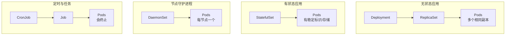

好的，请看下方为您整理的、基于原图的详细版Kubernetes工作负载资源笔记。这份笔记将严格按照图片的架构进行解释和扩展，力求清晰直观。

---

### **Kubernetes工作负载资源详解笔记（基于图表）**

#### **核心图解**
图表清晰地展示了Kubernetes中四种核心工作负载资源如何管理Pod的不同生命周期和部署模式。其核心关系可概括为下图所示的层次结构：

---

### **一、Deployment -> ReplicaSet -> Pods**
**(用于部署无状态应用)**

*   **Deployment（部署）**：
    *   **角色**： 应用发布的“总指挥”。
    *   **核心功能**：
            1.  **声明式更新**： 定义应用的期望状态（如：需要3个副本，使用Nginx:1.20镜像）。
            2.  **滚动更新与回滚**： 当需要更新应用版本时，它能自动地、逐步地用新Pod替换旧Pod，实现平滑升级。如果出新问题，可以一键回滚到上一个版本。
    *   **如何管理Pod**： Deployment并不直接管理Pod，而是通过创建和管理一个**ReplicaSet**来实现。

*   **ReplicaSet（副本集）**：
    *   **角色**： Deployment手下的“副本管理员”。
    *   **核心功能**： 确保**指定数量的、完全相同的Pod副本**始终处于运行状态。
        *   如果某个Pod挂了，ReplicaSet会立刻创建一个新的来替代。
        *   如果想从3个副本扩容到5个，ReplicaSet就会自动创建2个新的Pod。
    *   **注意**： 我们通常不直接操作ReplicaSet，所有操作都通过其上司——Deployment来完成。

*   **适用场景**： Web服务器（如Nginx）、API后端服务、微服务等**无状态**应用。

---

### **二、StatefulSet -> 有稳定标识的Pods**
**(用于部署有状态应用)**

*   **StatefulSet（有状态副本集）**：
    *   **角色**： 管理有状态应用的“大管家”。
    *   **核心功能**： 为每个Pod提供唯一的、稳定的标识。
        *   **稳定网络标识**： 每个Pod拥有固定的、可预测的主机名和DNS名称（如 `mysql-0`, `mysql-1`），即使Pod重启或重新调度，其名称和网络标识也不会改变。
        *   **稳定持久化存储**： 每个Pod都拥有自己专属的持久化存储卷。Pod重建后，仍然能挂载到原来的数据上，保证数据不丢失。
        *   **有序部署/伸缩**： 默认按顺序进行（如先启动`mysql-0`，再启动`mysql-1`）。

*   **与Deployment的Pod区别**： StatefulSet管理的Pod不是完全可互换的。每个Pod都有其独特性，拥有自己的身份和状态。

*   **适用场景**： 数据库（MySQL, PostgreSQL）、分布式中间件（Kafka, Redis Cluster, Zookeeper, Etcd）等**有状态**应用。

---

### **三、DaemonSet -> 每节点一个Pod**
**(用于部署节点级守护进程)**

*   **DaemonSet（守护进程集）**：
    *   **角色**： 集群节点的“标配部署员”。
    *   **核心功能**： 确保集群中**每个（或符合特定条件的）节点上都运行一个指定的Pod副本**。
        *   当有新节点加入集群时，DaemonSet会自动在该节点上创建一个Pod。
        *   当节点被移除时，对应的Pod也会被回收。
    *   **Pod副本数**： 不由用户直接指定，而是由集群中符合条件的节点数量决定。

*   **适用场景**：
    *   **日志收集器**： 如Fluentd、Filebeat，用于收集每个节点上所有容器的日志。
    *   **监控代理**： 如Prometheus Node Exporter，用于采集每个节点的硬件和操作系统监控指标。
    *   **网络插件**： 如Calico、Weave Net等CNI插件的网络代理组件。

---

### **四、CronJob -> Job -> 会终止的Pods**
**(用于运行批处理和定时任务)**

*   **CronJob（定时任务）**：
    *   **角色**： 任务调度器。
    *   **核心功能**： 基于类似Linux Cron的时间表（如 `0 2 * * *` 表示每天凌晨2点）来周期性地执行任务。

*   **Job（任务）**：
    *   **角色**： 一次性任务执行器。
    *   **核心功能**： 创建一个或多个Pod来执行一个特定的任务，并确保任务成功完成。如果任务执行失败，Job会按照预设策略重试Pod，直到任务成功达到指定次数为止。

*   **会终止的Pods**：
    *   **关键特征**： 这是Job/CronJob创建的Pod与上述其他资源Pod的**根本区别**。
    *   这些Pod不是为了“长期运行”，而是为了**完成特定工作而启动的**。任务执行完毕后，Pod就会**成功终止**，而不会被重启。这正是“会终止”的含义。

*   **适用场景**：
    *   **CronJob**： 每天凌晨的数据备份、每小时生成一次报告、定期清理临时文件。
    *   **Job**： 数据库迁移、批处理数据、离线渲染、一次性的计算任务。

### **总结**

| 工作负载资源 | 核心职责 | Pod 特征 | 关键区别 |
| :--- | :--- | :--- | :--- |
| **Deployment** | 无状态应用的生命周期管理 | 多个相同的、长期运行的、可替换的Pod | 支持滚动更新，最常用 |
| **StatefulSet** | 有状态应用的生命周期管理 | 有唯一标识和独立存储的、长期运行的Pod | 网络和存储稳定，Pod有序 |
| **DaemonSet** | 在每个节点上运行守护进程 | 每个节点一个的、长期运行的Pod | Pod与节点绑定，节点数即副本数 |
| **CronJob/Job** | 执行一次性或定时任务 | 执行完即终止的Pod | Pod非长期运行，任务完成即退出 |

这份笔记完全遵循了您提供的图片结构，并进行了详细的阐述。希望它能帮助您牢固掌握Kubernetes这一核心概念！