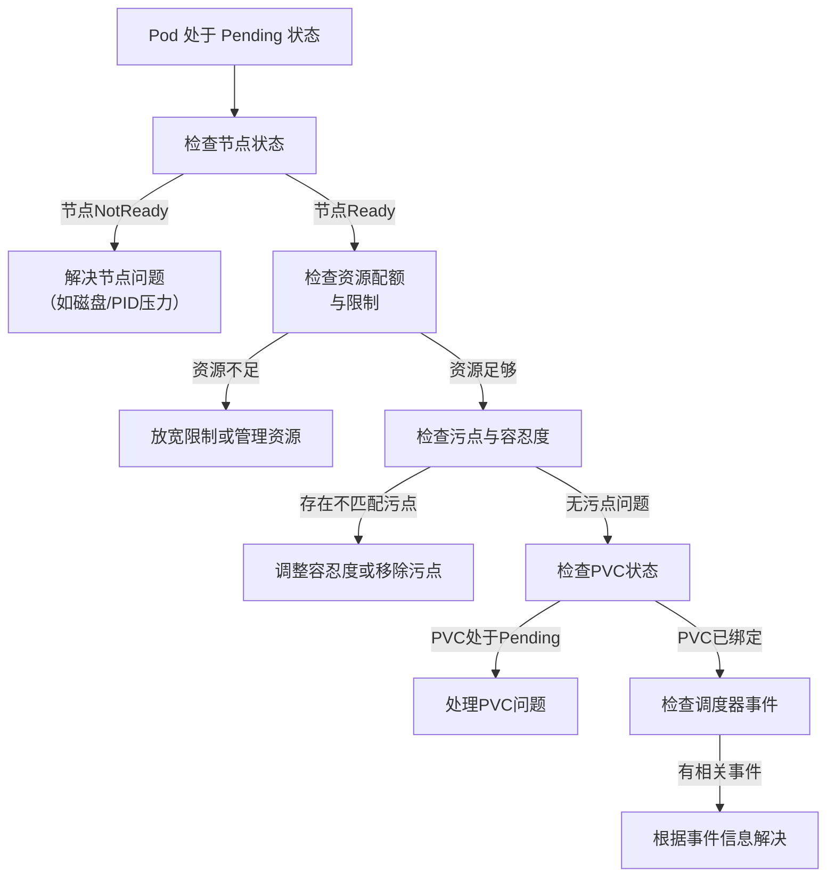
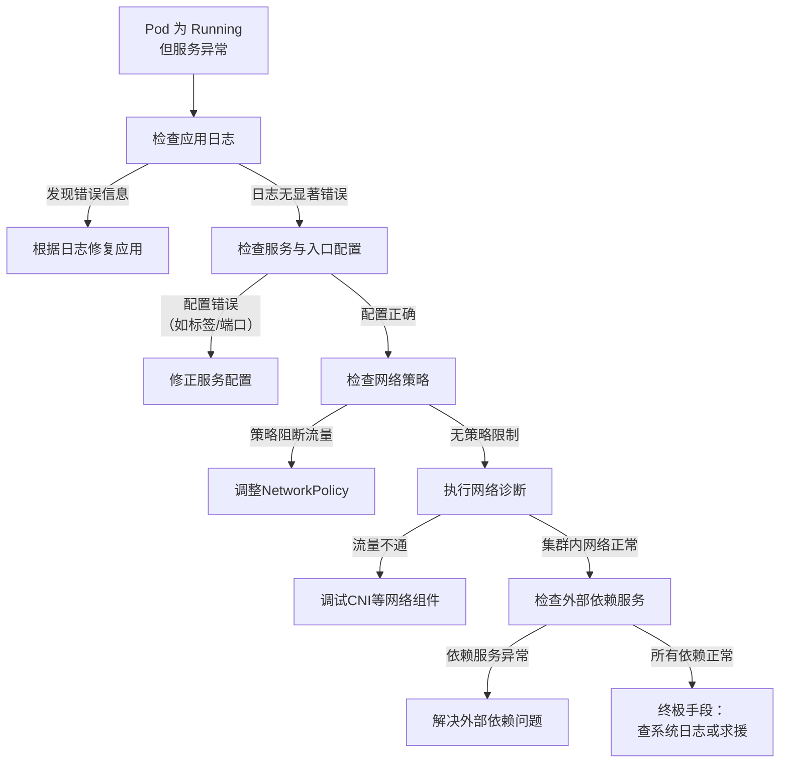

### **Kubernetes Pod 故障排查手册（基于流程图展开）**

这份手册将遵循流程图的核心逻辑：**由浅入深，逐层排查**。整个过程就像医生看病：先问诊（`get pods`），再详细检查（`describe pod`），然后根据症状（Pod状态）做专项检查（查日志、网络等），最后确诊治疗。

#### **第一步：初步检查 - 问诊与体检**

这是所有排查的起点，对应流程图最上方的两个命令。

1.  **`kubectl get pods -o wide`**
    *   **目的**：快速获取 Pod 列表的**全局视图**。
    *   **关键信息解读**：
        *   **`STATUS` 列**：这是最重要的信号灯。
            *   `Pending`：预约了门诊，但还没安排医生（等待调度）。
            *   `Running`：已就诊，正在治疗中（已调度并运行）。
            *   `CrashLoopBackOff`：病情反复，刚治好又复发（容器不断崩溃重启）。
            *   `ImagePullBackOff`：取药失败（镜像拉取错误）。
            *   `Error`：治疗过程中发生严重错误。
        *   **`READY` 列**：如 `0/1`，表示 Pod 内有一个容器，但还未就绪。就绪探针可能失败。
        *   **`NODE` 列** (`-o wide` 显示)：Pod 被调度到了哪个节点？这是后续排查节点问题的关键。

2.  **`kubectl describe pod <pod-name>`**
    *   **目的**：获取 Pod 的**详细病历**，这是排查中最关键的一步，包含了最丰富的诊断信息。
    *   **重点关注部分**：
        *   **`Events` 部分**：**必看！** 这里按时间顺序记录了 Pod 一生的所有重大事件，通常会直接告诉你问题根源，例如 `FailedScheduling`（调度失败）、`FailedMount`（存储挂载失败）。
        *   **`Status` 部分**：显示容器的详细状态（如 `Waiting`、`Terminated`）及其原因。
        *   **`Conditions` 部分**：显示 Pod 的各种条件状态（如 `PodScheduled`、`Initialized`、`Ready`）。

---

#### **第二步：分支排查 - 根据主要症状（Pod状态）深入检查**

根据 `kubectl get pods` 得出的 `STATUS`，进入不同的排查路径。

##### **路径 A：Pod 处于 `Pending` 状态**

**核心问题**：Pod 找不到合适的节点安家。

**排查链如下：**

**1. 检查节点状态**
    *   **命令**：`kubectl get nodes`
    *   **分析**：是否有节点状态为 `NotReady`？如果有，说明该节点本身有问题，Pod 自然无法调度上去。
    *   **深入排查节点**：`kubectl describe node <node-name>`
        *   查看 `Conditions` 部分，是否有 `DiskPressure`（磁盘压力）、`MemoryPressure`（内存压力）、`PIDPressure`（PID 压力）等异常。
        *   查看 `Capacity` 和 `Allocatable` 资源量。

**2. 检查资源配额与限制**
    *   **问题**：可能是整个命名空间的资源配额（ResourceQuota）用尽，也可能是 Pod 请求的资源超过了节点的可用资源。
    *   **检查配额**：`kubectl describe resourcequota -n <namespace>`
    *   **检查节点资源**：在 `kubectl describe node` 输出中，对比 `Allocatable`（可分配总量）和当前已分配的资源。

**3. 检查污点和容忍度**
    *   **原理**：节点可以打上`污点`来“拒绝”某些 Pod，Pod 必须声明对应的`容忍度`才能调度上去。
    *   **检查节点污点**：`kubectl describe node <node-name> | grep Taint`
    *   **检查 Pod 容忍度**：`kubectl describe pod <pod-name> | grep -A 10 Tolerations`
    *   **解决**：为 Pod 的 `spec.tolerations` 字段添加匹配的容忍度，或者移除节点的污点。

**4. 检查 PVC 状态**
    *   **命令**：`kubectl get pvc -n <namespace>`
    *   **分析**：如果 Pod 使用的 PVC 状态不是 `Bound`，而是 `Pending`，说明存储卷出了问题（如没有可用的 PV、StorageClass 错误）。Pod 会一直等待存储就绪。

**5. 检查调度器事件**
    *   **方法**：回头看 `kubectl describe pod` 的 `Events` 部分。
    *   **分析**：调度器非常智能，如果调度失败，它会明确记录原因，例如：
        *   `0/3 nodes are available: 1 node(s) had taint {node.kubernetes.io/not-ready: }...` （节点污点导致）
        *   `0/3 nodes are available: 3 Insufficient cpu.` （CPU 资源不足）

##### **路径 B：Pod 处于 `Running` 但服务异常**

**核心问题**：Pod 已在运行，但无法正常提供服务（如无法访问、报错）。

**排查链如下：**

**1. 检查应用日志**
    *   **命令**：
        *   `kubectl logs <pod-name>`：查看当前容器日志。
        *   `kubectl logs <pod-name> --previous`：如果容器重启过，查看上一个容器的日志（**对排查 CrashLoopBackOff 至关重要**）。
    *   **分析**：日志是应用自身的“自白”，通常会直接打印出错误堆栈、连接失败等信息。

**2. 进入容器调试**
    *   **命令**：`kubectl exec -it <pod-name> -- /bin/sh`（或 `/bin/bash`）。
    *   **目的**：检查容器内的配置文件、测试网络连通性（`ping`、`curl`、`nslookup`）、查看进程状态（`ps aux`），确保容器内部环境符合预期。

**3. 检查服务与入口配置**
    *   **核心**：检查 Service 和 Ingress。
    *   **Service**：
        *   **标签选择器**：Service 的 `spec.selector` 是否与 Pod 的 `metadata.labels` **完全匹配**？
        *   **端口**：Service 的 `spec.ports.targetPort` 是否与 Pod 内容器暴露的端口一致？
    *   **Ingress**：Ingress 的规则是否正确指向了后端的 Service？

**4. 检查网络策略**
    *   **命令**：`kubectl get networkpolicy -n <namespace>`
    *   **分析**：NetworkPolicy 是网络防火墙。检查是否有策略阻断了你的 Pod 的流量？默认情况下，如果存在任何 NetworkPolicy，则会启用默认的拒绝所有规则，你需要显式允许所需流量。

**5. 执行网络诊断**
    *   **从 Pod 内部诊断**：使用 `kubectl exec` 进入 Pod，执行 `nslookup <service-name>`（检查服务发现）、`curl -v <other-service-url>`（检查服务间连通性）、`ping <ip>`。
    *   **调试 CNI**：检查 Calico、Flannel 等网络插件的 Pod 是否正常运行，查看其日志。

**6. 检查外部依赖**
    *   **分析**：你的应用是否依赖数据库、缓存、消息队列或外部 API？这些外部服务是否健康且网络可达？
    *   **方法**：在 Pod 内部尝试连接这些外部依赖，确认其可用性。

---

### **总结：排查心态与终极方法**

1.  **遵循流程**：严格按照从 `get pods` -> `describe pod` -> 根据状态分支排查的顺序，可以避免盲目操作。
2.  **日志和事件是你的最佳朋友**：90% 的问题可以通过 `kubectl describe pod` 和 `kubectl logs` 找到答案。
3.  **终极手段**：如果以上所有步骤都无法解决问题，可以考虑：
    *   **查看系统组件日志**：如 `kubelet`（在节点上运行 `journalctl -u kubelet`）、API Server、网络插件等的日志。
    *   **寻求帮助**：将你的排查过程和发现（特别是 `describe` 和 `logs` 的输出）提供给社区或专家。

这份展开的介绍将流程图转化为了具体的思考和操作步骤，希望能成为您排查 Kubernetes 故障的强力工具。