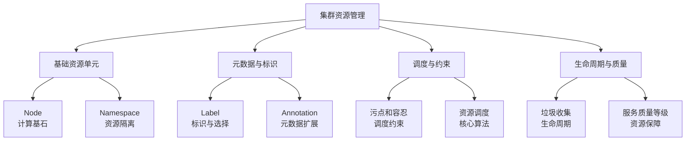

### **集群资源管理详细解读**

#### 1. **概述**

集群资源管理是 Kubernetes 的核心部分，它涉及管理 Kubernetes 集群中的所有资源。通过有效的资源管理，Kubernetes 能够确保应用程序的高可用性、可靠性和性能。资源管理包括节点、命名空间、标签、污点和容忍、资源调度、服务质量等级等多个方面。

---

#### 2. **Node（节点）**

* **定义**：Kubernetes 中的节点（Node）是一个物理或虚拟的机器，Pod 会被调度到节点上运行。每个节点由以下组件组成：

  * **Kubelet**：负责维护容器的运行状态，确保容器按预期运行。
  * **Kube Proxy**：维护集群的网络代理，确保 Pod 与外部通信的正确性。
  * **Container Runtime**：容器运行时，如 Docker 或 containerd，用于启动和管理容器。

* **节点的角色**：

  * **Master Node**：管理 Kubernetes 集群的控制节点，负责调度、控制和管理集群状态。
  * **Worker Node**：实际运行应用程序的节点，通过 Pod 来承载容器化的应用。

* **节点资源管理**：

  * 每个节点上都有可用的 CPU、内存、存储等资源。在 Kubernetes 中，你可以为节点设置资源限制和请求来进行资源调度。

* **节点的健康检查**：

  * 通过 `kubectl get nodes` 可以查看节点的状态。节点的状态包括 Ready、NotReady、SchedulingDisabled 等，Kubernetes 会定期检查节点的健康，确保节点处于正常运行状态。

---

#### 3. **Namespace（命名空间）**

* **定义**：命名空间是 Kubernetes 中的一个虚拟集群，用于逻辑上将集群中的资源进行分区。命名空间帮助将不同的应用、服务、团队或环境分隔开来，避免资源冲突。

* **命名空间的使用**：

  * **资源隔离**：通过命名空间隔离不同的服务或团队，以便于在同一集群中管理多个环境。
  * **访问控制**：不同的命名空间可以配合 RBAC（角色基于访问控制）来进行访问权限控制。
  * **示例**：可以为开发环境和生产环境分别创建命名空间。

* **创建命名空间**：

  ```yaml
  apiVersion: v1
  kind: Namespace
  metadata:
    name: dev
  ```

  使用命令：

  ```bash
  kubectl create namespace dev
  ```

* **使用命名空间**：

  * 创建资源时，可以指定该资源所属的命名空间。例如：

    ```bash
    kubectl create pod mypod --namespace=dev
    ```

* **默认命名空间**：

  * Kubernetes 默认有一个名为 `default` 的命名空间，所有没有明确指定命名空间的资源都将被放入该命名空间。

---

#### 4. **Label（标签）**

* **定义**：标签是 Kubernetes 用来组织、标识和选择资源的键值对。标签可以附加到任意 Kubernetes 资源（如 Pod、Service、Node 等）上。

* **作用**：

  * **选择器**：通过标签选择器，Kubernetes 可以选择多个符合条件的资源。服务发现、Pod 调度、资源分配等都会使用标签来识别和选择资源。
  * **分类**：通过标签对资源进行分类，例如按应用、环境、版本等分类。

* **创建标签**：
  标签在创建资源时添加。例如：

  ```yaml
  apiVersion: v1
  kind: Pod
  metadata:
    name: mypod
    labels:
      app: web
      environment: prod
  ```

* **使用标签选择器**：

  ```bash
  kubectl get pods -l app=web
  ```

  通过 `-l` 参数可以使用标签选择器，查询匹配标签的所有资源。

* **示例**：

  * `app: web`
  * `environment: production`
  * `tier: backend`

---

#### 5. **Annotation（注解）**

* **定义**：注解是 Kubernetes 用来附加非标识性元数据的键值对。注解存储的信息通常比标签更复杂且更详细，通常用于存储配置信息、调试数据或外部工具的配置信息。

* **与标签的区别**：

  * 标签用于选择和过滤资源，而注解通常用于存储与资源本身无关的元数据，例如应用的版本信息、历史记录等。
  * 注解的大小没有限制，可以存储比标签更长的数据。

* **创建注解**：
  注解通常在资源的元数据中定义：

  ```yaml
  apiVersion: v1
  kind: Pod
  metadata:
    name: mypod
    annotations:
      description: "This pod is used for web services"
      version: "v1.0.0"
  ```

---

#### 6. **污点和容忍（Taints and Tolerations）**

* **污点（Taint）**：

  * **定义**：污点是指将某个节点标记为不接受某些 Pod，目的是限制哪些 Pod 能够被调度到该节点上。
  * **作用**：通过污点，管理员可以限制某些节点只接受特定的 Pod。例如，限制某些节点只能运行高优先级的 Pod。

* **容忍（Toleration）**：

  * **定义**：容忍是指一个 Pod 能够容忍特定的污点，从而被调度到这些被污点标记的节点上。
  * **作用**：如果一个 Pod 配置了对应的容忍策略，它就可以被调度到污点节点上。

* **示例**：

  * 给节点添加污点：

    ```bash
    kubectl taint nodes node1 key=value:NoSchedule
    ```
  * 给 Pod 添加容忍：

    ```yaml
    tolerations:
      - key: "key"
        operator: "Equal"
        value: "value"
        effect: "NoSchedule"
    ```

---

#### 7. **垃圾收集（垃圾回收机制）**

* **定义**：垃圾回收机制用于定期清理集群中不再需要的资源，如删除不再使用的 Pod、容器、镜像等。

* **资源回收**：

  * **Pod 生命周期管理**：当 Pod 被删除时，其相关资源（如存储卷、容器等）会被清理。
  * **节点资源回收**：通过 `kubectl get pods --all-namespaces` 查看资源并手动清理。

* **自动垃圾回收**：Kubernetes 中有一些资源（如镜像）会根据一定规则自动清理，避免集群资源被过多占用。

---

#### 8. **资源调度（Resource Scheduling）**

* **定义**：资源调度是指 Kubernetes 根据节点资源的情况将 Pod 调度到合适的节点上运行。调度时，Kubernetes 会考虑节点的可用资源、Pod 的资源请求、调度策略等多个因素。

* **调度策略**：

  * **CPU 和内存请求与限制**：Pod 的资源请求与限制会影响调度过程。Kubernetes 会根据节点的资源和 Pod 的需求进行调度。
  * **亲和性与反亲和性**：使用亲和性（Affinity）和反亲和性（Anti-Affinity）来控制 Pod 调度，确保 Pod 运行在合适的节点或与其他 Pod 不冲突。

* **示例**：

  ```yaml
  affinity:
    podAffinity:
      requiredDuringSchedulingIgnoredDuringExecution:
        - labelSelector:
            matchExpressions:
              - key: "app"
                operator: In
                values:
                  - "nginx"
  ```

---

#### 9. **服务质量等级（QoS）**

* **定义**：服务质量等级用于控制 Pod 的优先级，以确保关键业务的高可用性。根据 Pod 中的资源请求和限制，Kubernetes 为 Pod 分配不同的优先级。
* **分类**：

  * **Guaranteed**：如果 Pod 为所有容器设置了相同的资源请求和限制，且二者相等，Pod 被视为 Guaranteed。
  * **Burstable**：如果 Pod 为部分容器设置了资源请求和限制，但二者不相等，则 Pod 被视为 Burstable。
  * **BestEffort**：如果 Pod 没有设置资源请求和限制，则 Pod 被视为 BestEffort。

---

### **总结与面试小贴士**

* **概念掌握**：确保你理解了每个概念的定义和作用，如节点、命名空间、标签、污点、容忍等。
* **命令熟悉**：熟练掌握 `kubectl` 命令，特别是如何查看、操作和管理命名空间、节点、Pod 及其标签和注解。
* **实际操作**：建议进行一些实际操作练习，例如创建命名空间、为 Pod 设置标签、污点与容忍等，帮助加深理解。




---

### **一、Node - 集群的计算基石**

**面试官想考察**：你是否理解 Pod 运行的物理基础，以及节点故障时的排查能力。

#### **1. 核心概念**
- **是什么**：Kubernetes 集群的工作单元，可以是物理机、虚拟机或云主机。
- **核心属性**：
  - **Capacity（容量）**：节点拥有的总资源量（CPU、内存、存储等）。
  - **Allocatable（可分配资源）**：`Capacity` 减去 `系统守护进程（kubelet、容器运行时等）预留资源`。
  - **Conditions（状态）**：`Ready`、`MemoryPressure`、`DiskPressure`、`PIDPressure` 等，反映节点健康状况。
  - **Addresses（地址）**：`InternalIP`、`ExternalIP`、`Hostname` 等。

#### **2. 面试重点与深度问题**
**Q1: 节点状态 NotReady 的可能原因及排查思路？**
**A**：这是一个经典的故障排查题，考察系统性思维。
```bash
# 1. 查看详细状态信息
kubectl describe node <node-name>

# 2. 查看节点事件
kubectl get events --field-selector involvedObject.kind=Node,involvedObject.name=<node-name>

# 3. 常见原因与排查命令
```
| 可能原因 | 排查命令 | 解决方案 |
| :--- | :--- | :--- |
| **kubelet 进程异常** | `systemctl status kubelet` | `systemctl restart kubelet` |
| **容器运行时（如 containerd）异常** | `systemctl status containerd` | `systemctl restart containerd` |
| **节点资源耗尽（内存、磁盘）** | `kubectl describe node` 看 `Conditions`; `df -h`; `free -m` | 清理资源或扩容 |
| **网络插件故障** | `kubectl get pods -n kube-system` | 检查 Calico/Flannel 等网络插件 Pod 状态 |
| **节点与 Master 网络不通** | `ping <master-ip>`; `telnet <master-ip> 6443` | 检查网络配置、安全组、防火墙 |

**Q2: Capacity 和 Allocatable 有什么区别？**
**A**：
- **Capacity**：节点的物理资源总量。
- **Allocatable**：可供 Pod 使用的资源量，计算公式为：`Allocatable = Capacity - [KubeReserved] - [SystemReserved] - [EvictionThreshold]`。
- **设计哲学**：这个设计保证了节点资源的合理分配，确保系统组件和 kubelet 有足够资源运行，避免因资源竞争导致节点不稳定。

**Q3: 如何安全地对节点进行维护（如内核升级）？**
**A**：考察节点生命周期管理能力。
```bash
# 1. 标记节点为不可调度（Cordon）
kubectl cordon <node-name>

# 2. 驱逐节点上的 Pod（Drain）
kubectl drain <node-name> --ignore-daemonsets --delete-emptydir-data
# --ignore-daemonsets: 忽略 DaemonSet 管理的 Pod（它们需要每个节点运行一个实例）
# --delete-emptydir-data: 删除使用 emptyDir 的 Pod（数据会丢失，需谨慎）

# 3. 进行维护操作...

# 4. 维护完成后，标记节点为可调度（Uncordon）
kubectl uncordon <node-name>
```

---

### **二、Namespace - 资源隔离与多租户**

**面试官想考察**：你对集群资源隔离、多租户和环境管理的理解。

#### **1. 核心概念**
- **是什么**：虚拟集群，用于将物理集群划分为多个虚拟集群，实现资源隔离。
- **默认 Namespace**：
  - `default`：用户资源的默认命名空间。
  - `kube-system`：Kubernetes 系统组件（如 kube-proxy、CoreDNS）的命名空间。
  - `kube-public`：所有用户（包括未认证用户）可读的命名空间，通常放置集群信息。
  - `kube-node-lease`：存放节点租约（Lease）对象，用于检测节点心跳。

#### **2. 面试重点与深度问题**
**Q1: Namespace 都隔离了哪些资源？哪些是全局的？**
**A**：这是考察你对 API 资源作用域的理解。
- **命名空间级资源（Namespaced）**：Pod, Service, ConfigMap, Secret, Deployment, StatefulSet 等。它们属于某个特定的 Namespace。
- **集群级资源（Cluster-wide）**：Node, PersistentVolume, ClusterRole, StorageClass 等。它们不属于任何 Namespace，是全局的。

**Q2: 如何实现多租户？ResourceQuota 和 LimitRange 的作用？**
**A**：这是 Namespace 的核心应用场景。
```yaml
# 1. ResourceQuota：限制命名空间的总资源消耗
apiVersion: v1
kind: ResourceQuota
metadata:
  name: compute-resources
  namespace: tenant-a
spec:
  hard:
    requests.cpu: "2" # 所有 Pod 的 CPU 请求总和不能超过 2核
    requests.memory: 4Gi
    limits.cpu: "4"
    limits.memory: 8Gi
    pods: "10" # 命名空间内最多 10 个 Pod
    services: "5"
    configmaps: "10"
    persistentvolumeclaims: "5"
```
```yaml
# 2. LimitRange：为命名空间内的个体（Pod/Container）设置默认资源限制
apiVersion: v1
kind: LimitRange
metadata:
  name: mem-limit-range
  namespace: tenant-a
spec:
  limits:
  - default: # 默认限制
      memory: 512Mi
      cpu: "500m"
    defaultRequest: # 默认请求
      memory: 256Mi
      cpu: "250m"
    type: Container
```
- **设计哲学**：`ResourceQuota` 是“粗粒度”的命名空间级别限制，防止一个团队耗尽集群资源；`LimitRange` 是“细粒度”的 Pod/容器级别限制，确保单个应用行为可控。

**Q3: 网络策略（NetworkPolicy）和 Namespace 的关系？**
**A**：`NetworkPolicy` 是实现网络隔离的关键，它通常基于 `Namespace` 或 `Pod Label` 来定义规则。
```yaml
apiVersion: networking.k8s.io/v1
kind: NetworkPolicy
metadata:
  name: deny-from-other-namespaces
  namespace: production
spec:
  podSelector: {} # 选择本命名空间的所有 Pod
  policyTypes:
  - Ingress
  ingress:
  - from:
    - podSelector: {} # 只允许来自同一命名空间内的 Pod 的流量
```
- **面试点拨**：要实现真正的多租户隔离，需要结合 `Namespace`、`ResourceQuota`、`NetworkPolicy` 和 RBAC。

---

### **三、Label 和 Annotation - 元数据的力量**

**面试官想考察**：你是否理解 K8s 的“标签化”设计哲学和灵活配置能力。

#### **1. 核心概念与区别**
| 特性 | Label | Annotation |
| :--- | :--- | :--- |
| **目的** | **标识（Identity）**，用于**选择（Selection）** 对象 | **记录元数据（Metadata）**，供工具或库使用 |
| **选择器** | 支持等值（`=`, `==`, `!=`）和集合（`in`, `notin`, `exists`）选择 | **不支持**作为选择条件 |
| **数据大小** | 键值对，有严格格式和长度限制 | 键值对，可存储较大数据（如配置信息） |
| **示例** | `app=frontend`, `tier=web`, `version=v1.2.3` | `deployment.kubernetes.io/revision: "2"`, 配置说明，构建信息 |

#### **2. 面试重点与深度问题**
**Q1: 为什么说 Label 是 K8s 实现灵活性与自动化的基石？**
**A**：因为它实现了**松耦合**的设计。
- **服务发现**：`Service` 通过 `selector` 选择具有特定 Label 的 Pod，Pod 的创建和销毁自动反映到 Service 的 Endpoints 中。
- **滚动更新**：`Deployment` 通过切换 ReplicaSet 的 Pod 模板 Label（如 `version: v2`）来实现无缝更新。
- **管理工作负载**：所有控制器（Deployment, DaemonSet, StatefulSet）都通过 Label Selector 来管理其控制的 Pod。

**Q2: 你在实践中如何设计一套清晰的 Label 体系？**
**A**：考察最佳实践。推荐使用https://kubernetes.io/docs/concepts/overview/working-with-objects/common-labels/。
```yaml
metadata:
  labels:
    # 标准化标签，便于管理和工具集成
    app.kubernetes.io/name: "nginx"
    app.kubernetes.io/instance: "nginx-prod"
    app.kubernetes.io/version: "1.19"
    app.kubernetes.io/component: "webserver"
    app.kubernetes.io/part-of: "web-frontend" # 此应用所属的更上层应用
    app.kubernetes.io/managed-by: "helm"
```
**优点**：标签一致，便于通过 `kubectl get pods -l app.kubernetes.io/name=nginx` 等命令进行统一管理。

**Q3: Annotation 的典型应用场景有哪些？**
**A**：
1.  **配置信息**：`kubernetes.io/ingress.class: "nginx"`，告诉 Ingress 控制器使用哪个 Ingress Class。
2.  **滚动更新控制**：`deployment.kubernetes.io/revision: "2"`，记录 Deployment 的版本。
3.  **工具集成**：`kubectl.kubernetes.io/last-applied-configuration`，供 `kubectl apply` 命令进行三方合并。
4.  **描述信息**：`description`，`contact` 等，方便运维人员理解资源用途。

---

由于内容非常详细，篇幅所限，我将分两部分呈现。第一部分（Node, Namespace, Label, Annotation）到此为止。

**接下来是第二部分的核心要点预览**：

### **四、污点（Taint）和容忍（Toleration）**
- **核心**：节点“排斥”Pod 的机制。与亲和性（Affinity）相反，是“从节点出发”的调度约束。
- **面试重点**：
  - 三种效应（Effect）：`NoSchedule`（不调度）、`PreferNoSchedule`（尽量不调度）、`NoExecute`（不调度并驱逐已有 Pod）。
  - 应用场景：专用节点（如 GPU 节点）、Master 节点隔离、故障节点驱逐。
  - 问法：“如何保证 Master 节点只运行系统 Pod？”

### **五、垃圾收集（Garbage Collection）**
- **核心**：基于 `OwnerReference` 的级联删除机制。确保删除父资源（如 Deployment）时，其子资源（如 Pod）也被自动清理。
- **面试重点**：
  - 三种删除策略：`Foreground`（前台，先删子资源）、`Background`（后台，默认，先删父资源）、`Orphan`（孤儿，只删父资源）。
  - 问法：“删除一个 Deployment 时，K8s 内部发生了什么？”

### **六、资源调度（Resource Scheduling）**
- **核心**：kube-scheduler 为 Pod 选择合适节点的过程。
- **面试重点**：
  - 调度流程：`预选（Filtering）` -> `优选（Scoring）` -> `绑定（Binding）`。
  - 调度策略：节点亲和性（nodeAffinity）、Pod 亲和性/反亲和性（podAffinity/podAntiAffinity）。
  - 问法：“调度器是如何工作的？如何让 Pod 分散在不同的可用区？”

### **七、服务质量等级（QoS）**
- **核心**：根据 Pod 的资源请求（Requests）和限制（Limits），将其分为三个等级，在节点资源不足时，根据等级决定 Pod 的驱逐顺序。
- **面试重点**：
  - 三个等级：`Guaranteed`（请求等于限制）、`Burstable`（有请求，但小于限制）、`BestEffort`（无请求无限制）。
  - 驱逐顺序：`BestEffort` -> `Burstable` -> `Guaranteed`。
  - 问法：“如何保证关键业务 Pod 在资源紧张时最后被驱逐？”

---

这份指南的第一部分已经为您建立了坚实的基础。如果您认为这个详略程度和风格符合您的要求，请告诉我，我将立即为您完成剩余部分的详细整理。这四部分（污点与容忍、垃圾收集、资源调度、QoS）同样是面试的重中之重。